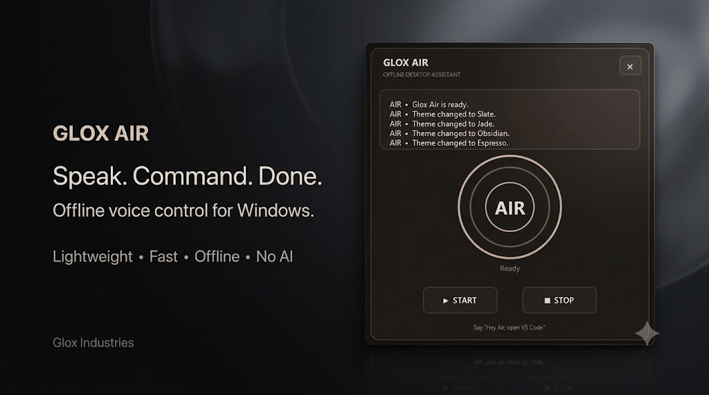

<p align="center">
  
</p>

<p align="center">
  
  
  
  
  
  
</p>

# Glox Air

**Glox Air** is a lightweight offline voice assistant for Windows, designed to recognize spoken commands and perform supported desktop actions.

It focuses on being **fast, lightweight, offline, and simple** — without requiring AI or cloud-based processing.

> **Speak. Command. Done.**

---

## ✨ Features

| Feature                    | Description                                        |
| -------------------------- | -------------------------------------------------- |
| 🎙️ **Voice Commands**     | Recognizes spoken commands through your microphone |
| 📴 **Offline Operation**   | Designed around local desktop functionality        |
| ⚡ **Lightweight**          | Built to remain lightweight and responsive         |
| 🤖 **No AI Required**      | Glox Air does not rely on generative AI            |
| 🚀 **App Launching**       | Open supported applications and executables        |
| 🌐 **Website Commands**    | Open websites through voice commands               |
| 🎮 **Game Launching**      | Launch supported games and shortcuts               |
| 🎵 **Media Controls**      | Control supported media actions                    |
| ⏱️ **Timers**              | Create and manage timers through commands          |
| 📁 **Folder Shortcuts**    | Quickly open supported folders                     |
| 🌙 **Multiple Themes**     | Customize the appearance using available themes    |
| 💾 **Persistent Settings** | Saves supported preferences and configuration      |
| 🪟 **Windows Focused**     | Designed specifically for Windows desktop usage    |

---

## 🎯 What Is Glox Air?

Glox Air is built around a simple idea:

**Use your voice to control your desktop without needing a heavy AI assistant.**

Instead of functioning as a chatbot, Glox Air listens for supported voice commands, recognizes what was said, and performs the corresponding desktop action.

The goal is a simple workflow:

```text
🎙️ Speak
   ↓
🧠 Recognize
   ↓
⚡ Execute
   ↓
✅ Done
```

---

## 🚀 Download

Want to try Glox Air?

**Download the latest available build and installation information from:**

<p align="center">
  <a href="DOWNLOAD.md">
    
  </a>
</p>

For complete download instructions, available builds, requirements, and setup information, open **[DOWNLOAD.md](DOWNLOAD.md)**.

---

## 🖥️ Designed For

Glox Air is designed for users who want:

* A lightweight desktop voice utility
* Simple voice-controlled actions
* Fast command execution
* A clean desktop experience
* No generative AI dependency
* No unnecessary software bloat

---

## 🔧 Technology

Glox Air currently uses a lightweight Python-based desktop stack.

| Technology                  | Purpose                               |
| --------------------------- | ------------------------------------- |
| **Python**                  | Core application logic                |
| **Tkinter**                 | Desktop interface                     |
| **SoundDevice**             | Microphone audio capture              |
| **SpeechRecognition**       | Speech recognition                    |
| **PyAudio / Audio Backend** | Audio processing support              |
| **Pyttsx3**                 | Local text-to-speech                  |
| **JSON**                    | Persistent settings and configuration |

---

## 🎨 Glox Philosophy

Glox Air follows the broader Glox philosophy:

> **Building Softwares With a New Vision.**

The focus is on creating useful desktop software without unnecessary complexity, advertising, or bloat.

---

## 👨‍💻 Credits

<p align="center">
  <b>AvgLucer | Gaurav W</b><br>
  CEO & Founder — <b>Glox Industries</b>
</p>

<p align="center">
  Building Softwares With a New Vision.
</p>

---

## ⚠️ Educational & User-Purpose Notice

<table>
<tr>
<td>

### 🟨⚠️ WARNING

**Glox Air is provided for user purposes, educational purposes, and teaching purposes only.**

This project is intended to demonstrate software development, desktop application development, voice-command systems, Python programming, and related concepts.

**Do not present, submit, publish, or distribute this project as your own original work.**

If you study, modify, reference, or learn from this project, respect the original creator and **AvgLucer | Gaurav W / Glox Industries**.

This project must not be falsely represented as independently created work.

</td>
</tr>
</table>

---

<p align="center">
  <sub> AvgLucer | Gaurav W — Glox Industries</sub><br>
  <sub>Building Softwares With a New Vision.</sub>
</p>
