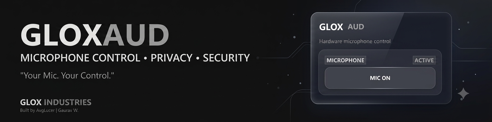

# GloxAud

<p align="center">
  
</p>

<p align="center">
  <strong>Microphone Control • Privacy • Security</strong>
</p>

<p align="center">
  <a href="https://github.com/AvgLucer/GloxWidgets">
    
  </a>
  
  
  
</p>

<p align="center">
  <i>Your Mic. Your Control.</i>
</p>

---

## 🎙️ About

**GloxAud** is a lightweight microphone control and privacy utility developed as part of the **Glox Industries** widget ecosystem.

It is designed around one simple idea:

> **Give the user fast and visible control over their microphone.**

GloxAud provides a clean desktop interface for controlling microphone availability without unnecessary complexity.

---

## ✨ Features

* 🎙️ **Microphone Control**

  * Quickly control microphone availability.

* 🔒 **Privacy-Focused**

  * Designed with microphone privacy and user awareness in mind.

* 🖥️ **Clean Desktop UI**

  * Modern interface designed for the Glox widget ecosystem.

* ⚡ **Lightweight**

  * Built to remain simple and focused on its core purpose.

* 🎨 **Glox Design Language**

  * Consistent with the visual identity of the Glox Industries ecosystem.

* 🧩 **Widget-Based Architecture**

  * Designed as part of the growing Glox Widgets collection.

---

## 🖼️ Preview

<p align="center">
  
</p>

---

## 📦 Download

Want to use the packaged version instead of running the source code?

See the dedicated download guide:

👉 **[DOWNLOAD.md](DOWNLOAD.md)**

The download guide contains the available release/package information and instructions.

---

## 🛠️ Installation

Clone the repository:

```bash
git clone https://github.com/AvgLucer/GloxWidgets.git
```

Navigate to the GloxAud directory:

```bash
cd GloxWidgets/GloxAud
```

Install the required dependencies if a requirements file is provided:

```bash
pip install -r requirements.txt
```

Run GloxAud:

```bash
python gloxaud.py
```

> File names and installation requirements may vary depending on the current version of the project.

---

## 🚀 Usage

1. Launch **GloxAud**.
2. Use the microphone control provided by the interface.
3. Check the current microphone state.
4. Enable or disable microphone access as required.
5. Close the application when finished.

GloxAud is intentionally designed to keep the interaction simple and understandable.

---

## 🧱 Project Structure

```text
GloxAud/
│
├── banner.png
├── SRC/gloxaud.py
├── DOWNLOAD.md
├── README.md
```

The structure may evolve as new GloxAud features and releases are introduced.

---

## 🎨 Glox Industries

**GloxAud** is one of the projects in the **Glox Widgets** ecosystem.

Glox Widgets is a collection of lightweight desktop utilities built around the idea of creating useful, focused tools with a consistent visual identity.

More widgets and utilities are being developed as part of the ongoing **Glox Industries** project.

---

## 🧑‍💻 Credits

### Built By

**AvgLucer | Gaurav W.**

Creator and developer of the Glox Widgets ecosystem.

### Brand

**GLOX INDUSTRIES**

A collection of experimental and practical software projects focused on desktop utilities, productivity, privacy, customization, and developer-oriented tools.

---

## 📜 Disclaimer & Educational Use Warning

> ⚠️ **WARNING — EDUCATIONAL USE ONLY**
>
> GloxAud and the source code contained in this repository are provided **only for educational, teaching, learning, research, and understanding purposes**.
>
> Do **not** present this project, its source code, design, concepts, or substantial portions of its implementation as your own work.
>
> If you study, modify, reference, or build upon this project, provide appropriate credit to the original author and clearly distinguish your work from the original GloxAud project.
>
> This project is intended to help users understand software development, desktop application design, microphone control concepts, and related programming techniques.
>
> **Built by AvgLucer | Gaurav W. — Glox Industries**

---

<p align="center">
  <strong>GLOX INDUSTRIES</strong>
  <br>
  <sub>Built by AvgLucer | Gaurav W CEO & Founder at Glox Industries.</sub>
</p>
