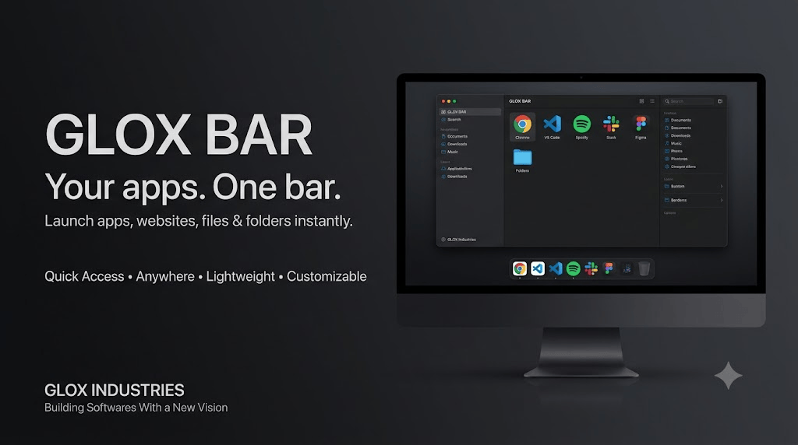

<div align="center">



# GloxBar

### Lightweight Quick Apps Widget for Windows

[](https://www.python.org/)
[](https://doc.qt.io/qtforpython/)
[](https://www.microsoft.com/windows)
[](#warning)
[](#)

**GloxBar** is a lightweight floating quick-access widget designed to give you instant access to your favorite applications, websites, files, and folders.

Instead of using a traditional taskbar for everything, GloxBar gives you a small, customizable bar that can stay on top of your desktop and launch whatever you configure.

---

## ✨ Features

| Feature                     | Description                                                 |
| --------------------------- | ----------------------------------------------------------- |
| 🚀 Quick Launch             | Launch applications instantly from three configurable slots |
| 🌐 Websites                 | Open websites directly from the widget                      |
| 📁 Files & Folders          | Configure files and folders as quick-access targets         |
| 🖱️ Drag Anywhere           | Move GloxBar freely around your desktop                     |
| 📌 Always on Top            | Keeps the widget accessible above other windows             |
| 🎨 Multiple Themes          | Obsidian, Graphite, Espresso, Slate, Midnight and Carbon    |
| 👻 Adjustable Opacity       | Choose between 100%, 80%, 60% and 50% opacity               |
| ⚙️ App Manager              | Easily configure names and targets for all three slots      |
| 🔄 Refresh                  | Reload configuration without restarting the widget          |
| 💾 Persistent Configuration | Settings are stored locally in `gloxbar_config.json`        |
| 🪶 Lightweight              | Designed to remain simple and unobtrusive                   |

---

## 🖥️ How It Works

GloxBar provides **three customizable quick-access slots**.

Each slot can point to:

* Windows applications
* Executables
* Websites
* Files
* Folders
* Other supported shell commands

Configure your targets once and launch them directly from the floating bar.

---

## 🎨 Themes

GloxBar currently includes:

| Theme    | Style           |
| -------- | --------------- |
| Obsidian | Dark neutral    |
| Graphite | Graphite gray   |
| Espresso | Warm dark brown |
| Slate    | Dark blue-gray  |
| Midnight | Deep blue       |
| Carbon   | Minimal dark    |

Each theme changes the appearance of the widget while keeping the same functionality.

---

## ⚙️ Configuration

GloxBar automatically creates:

```text
gloxbar_config.json
```

The configuration stores:

* App slot names
* App targets
* Selected theme
* Widget opacity

This allows your configuration to persist between launches.

---

## 📦 Download

The downloadable release is provided separately.

### 👉 [Download GloxBar](DOWNLOAD.md)

The `DOWNLOAD.md` file contains the official download link and basic download information.

---

## 🛠️ Technology

| Technology   | Purpose                         |
| ------------ | ------------------------------- |
| Python       | Core application                |
| PySide6      | Desktop UI                      |
| JSON         | Local configuration             |
| `subprocess` | Application / command launching |
| `webbrowser` | Website launching               |

---

## 👤 Credits

**AvgLucer | Gaurav W**
**CEO & Founder at Glox Industries**

Glox Industries
*Building Softwares With a New Vision*

---

## ⚠️ Warning

> **Educational / User / Teaching Purpose Only**
>
> GloxBar is provided for **user, educational, learning, demonstration, and teaching purposes only**.
>
> Do **not** present, claim, or redistribute this project as your own original project.
>
> If you use, study, demonstrate, modify, or reference this project, respect the original creator and attribution.
>
> **Credits:** AvgLucer | Gaurav W — CEO & Founder at Glox Industries

---

<div align="center">

**Glox Industries**

*Building Softwares With a New Vision*

</div>
