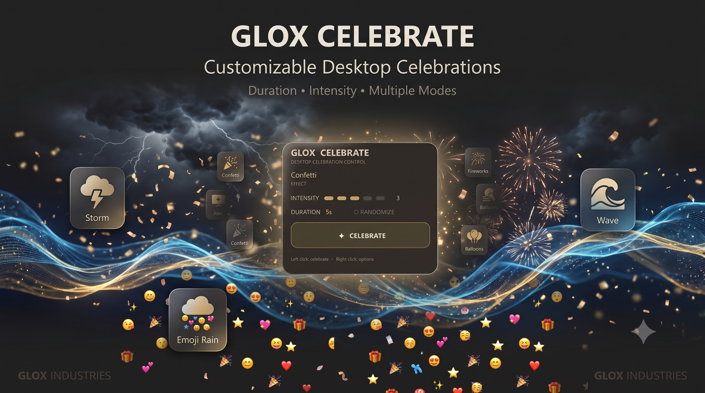

<div align="center">



# 🎉 Glox Celebrate

### A customizable desktop celebration utility built under the Glox ecosystem.

<p>


</p>

<p>


</p>

</div>

---

## 🎉 About

**Glox Celebrate** is a lightweight desktop celebration utility designed to make achievements, milestones, launches, victories, and random moments a little more fun.

Customize the celebration by controlling its **duration**, **intensity**, and **mode**.

Whether you've finished a project, fixed a difficult bug, reached a milestone, or simply want to celebrate something on your desktop — Glox Celebrate is built for it.

---

## ✨ Features

* 🎊 **Multiple Celebration Modes** — Choose from a variety of visual celebration styles.
* ⏱️ **Adjustable Duration** — Decide how long the celebration lasts.
* 🔥 **Adjustable Intensity** — Control how energetic the celebration becomes.
* 🖥️ **Desktop Utility** — Designed specifically for desktop use.
* ⚡ **Lightweight** — Focused on a simple and efficient experience.
* 🎨 **Glox UI** — Designed around the visual identity of the Glox ecosystem.
* 🧩 **Customizable Experience** — Mix different settings to create your preferred celebration.

---

## 🎯 Why Glox Celebrate?

Not every project needs to solve a massive problem.

Sometimes...

You just need to celebrate. 🎉

Finished your project?

**Celebrate.**

Fixed a bug after three hours?

**Celebrate.**

Got your first GitHub star?

**CELEBRATE.**

---

## ⚙️ Customization

Glox Celebrate provides three main controls:

### ⏱️ Duration

Control how long the celebration remains active.

### 🔥 Intensity

Adjust the energy and visual density of the celebration.

### 🎊 Mode

Choose between the available celebration modes and effects.

---

## 🛠️ Built With

| Technology         | Purpose                            |
| ------------------ | ---------------------------------- |
| 🐍 Python          | Core application                   |
| 🖥️ Desktop GUI    | Application interface              |
| 🎨 Visual Effects  | Celebration experience             |
| ⚙️ Local Execution | Runs locally on the user's machine |

---

## 📦 Installation

Clone the repository:

```bash
git clone https://github.com/GloxWidgets/GloxCelebrate.git
```

Enter the project directory:

```bash
cd GloxCelebrate
```

Install dependencies if `requirements.txt` is included:

```bash
pip install -r requirements.txt
```

Run the application using the project's Python entry point.

---

## ⬇️ Download

Want the easiest way to get Glox Celebrate?

### 👉 [Download Glox Celebrate](DOWNLOAD.md)

The **DOWNLOAD.md** file contains the available download options and installation information.

> Always obtain downloads from the official Glox Celebrate repository or release sources linked by the project.

---

## 🖼️ Preview


---

## 🗺️ Roadmap

Potential future improvements:

* [ ] Additional celebration modes
* [ ] More visual effects
* [ ] Custom celebration presets
* [ ] More intensity levels
* [ ] Custom colors
* [ ] Additional animations
* [ ] Sound effects
* [ ] More customization options
* [ ] Improved performance
* [ ] Additional platform support

---

## 🤝 Contributing

Contributions and ideas are welcome.

If you want to improve Glox Celebrate:

1. Fork the repository.
2. Create a feature branch.
3. Make your changes.
4. Test the project.
5. Open a pull request.

Example:

```bash
git checkout -b feature/new-celebration-mode
```

---

## ⭐ Support

If you enjoy Glox Celebrate, consider giving the repository a ⭐.

It helps the project get discovered and supports further development.

---

## 📜 License

Please refer to the license included in this repository for the applicable terms of use and distribution.

---

## 👤 Credits

### Glox Industries

**Created by AvgLucer | Gaurav W**

Part of the **Glox Widgets** project ecosystem.

---

# ⚠️ WARNING

**Glox Celebrate is provided for educational, teaching, learning, understanding, experimentation, and personal user purposes only.**

Please use this project responsibly.

Do **not** misrepresent this project or its source code as your own work.

If you use, modify, study, demonstrate, or redistribute any portion of this project, respect the applicable license and give appropriate credit to the original creator where required.

---

<div align="center">

### 🎉 Celebrate the little wins.

**GLOX INDUSTRIES**

**AvgLucer | Gaurav W**

</div>
