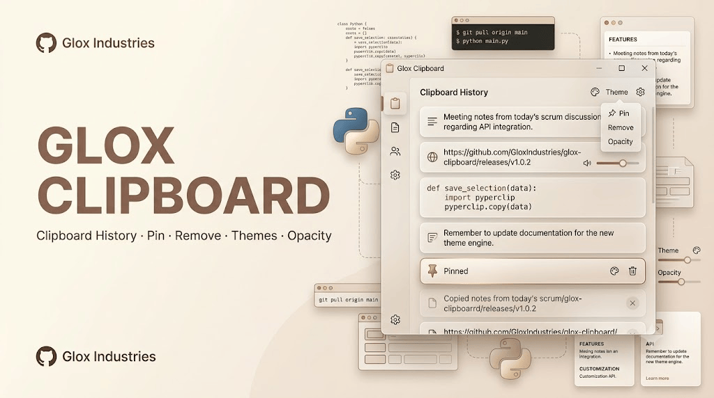

# Glox Clipboard


<p align="center">
  
</p>

> **A powerful, lightweight clipboard history manager for Windows.**

**Glox Clipboard** is a sleek desktop clipboard utility designed to keep your copied content organized, accessible, and customizable. It maintains a history of copied items so you can quickly revisit, reuse, pin, or remove anything you've copied.

Built as part of the **Glox Industries** ecosystem with a focus on simplicity, performance, and polished desktop UI.

---

## ✨ Features

### 📋 Clipboard History

Keep a running list of your recently copied content.

* Automatically stores copied items
* Quickly browse previous clipboard entries
* Supports repeated clipboard usage without losing older content
* Clean, compact widget interface
* Easily reuse previously copied content

### 📌 Pin Items

Keep important clipboard entries permanently accessible.

* Pin frequently used items
* Pinned content remains easy to find
* Useful for frequently copied text, links, commands, snippets, and notes

### 🗑️ Remove Items

Keep your clipboard history clean.

* Remove individual clipboard entries
* Quickly clear unwanted content
* Maintain a cleaner history without restarting the application

### 🎨 Multiple Themes

Customize the appearance of Glox Clipboard.

* Multiple built-in themes
* Switch between themes directly from the widget
* Designed around the Glox glassmorphism aesthetic
* Different visual styles for different desktop setups

### 🪟 Adjustable Opacity

Control how transparent the widget appears.

* Increase transparency for a subtle desktop presence
* Increase opacity for better readability
* Customize the widget to fit your desktop environment

### 💎 Glassmorphism UI

Glox Clipboard follows the visual language of the Glox Industries ecosystem.

* Frosted glass interface
* Smooth rounded components
* Modern desktop-widget design
* Minimal and clean layout
* Lightweight visual presentation

### ⚡ Lightweight

Designed to remain a small and practical desktop utility.

* Simple clipboard workflow
* No unnecessary interface complexity
* Designed for quick access
* Built as a standalone Glox utility

---

## 🚀 Download

Looking for installation instructions, releases, or the downloadable version?

### 👉 **[Go to `DOWNLOAD.md`](DOWNLOAD.md)**

The `DOWNLOAD.md` file contains the download and installation information for Glox Clipboard.

---

## 🖥️ How It Works

Glox Clipboard runs as a desktop widget and monitors your clipboard for new content.

```text
Copy Something
      ↓
Glox Clipboard Detects It
      ↓
Item Added to History
      ↓
┌──────────────────────────┐
│     Glox Clipboard       │
│                          │
│ 📌 Important Text        │
│ 🔗 Website Link          │
│ 💻 Code Snippet          │
│ 📝 Notes                 │
│                          │
└──────────────────────────┘
      ↓
Pin • Reuse • Remove
```

This makes it easy to retrieve something you copied earlier without repeatedly switching between applications.

---

## 🎨 Customization

Glox Clipboard is designed to feel like a native part of your desktop.

You can customize:

| Customization            | Available |
| ------------------------ | --------- |
| Clipboard History        | ✅         |
| Pin Items                | ✅         |
| Remove Items             | ✅         |
| Multiple Themes          | ✅         |
| Adjustable Opacity       | ✅         |
| Glassmorphism UI         | ✅         |
| Desktop Widget Interface | ✅         |

---

## 🧩 Part of Glox Industries

**Glox Clipboard** is part of the growing collection of desktop utilities developed under **Glox Industries**.

The Glox ecosystem focuses on creating lightweight, useful, visually polished applications and widgets for everyday desktop workflows.

---

## 👨‍💻 Credits

### AvgLucer | Gaurav W

**CEO & Founder — Glox Industries**

Designed, developed, and maintained as part of the Glox Industries project ecosystem.

---

## 🏢 Glox Industries

**Glox Industries**
*Building lightweight tools, utilities, and software experiences.*

---

> **⚠️ Usage & Ownership Notice**
>
> This project is provided **only for user, educational, learning, and teaching purposes**.
>
> It must **not be claimed, presented, redistributed, or submitted as another person's own project or original work**.
>
> If you use, study, modify, or reference this project for educational purposes, please retain the original attribution and credit **AvgLucer | Gaurav W — CEO & Founder at Glox Industries**.
