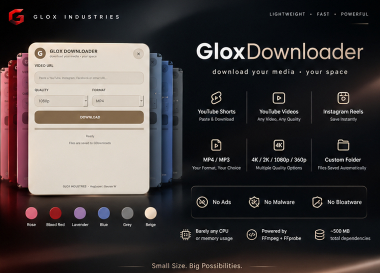

<p align="center">
  
</p>

<p align="center">
  
  
  
  
  
</p>

<h1 align="center">GloxDownloader</h1>

<p align="center">
  <b>Download your media • your space</b>
</p>

<p align="center">
  A lightweight desktop media downloader built with a clean, customizable widget experience.
</p>

---

## Features

| Feature | Description |
|---|---|
| 🎬 YouTube Videos | Download supported normal YouTube videos using their URL. |
| ⚡ YouTube Shorts | Paste a YouTube Shorts link and download the media. |
| 📱 Instagram Reels | Download supported Instagram Reels from their URL. |
| 🎚️ Multiple Quality Options | Choose from 4K, 2K, 1080p, or 360p. |
| 🎵 Multiple Formats | Choose between MP4 and MP3. |
| 📁 Designated Download Folder | Downloaded files are saved to the designated folder. |
| 🎨 Multiple Themes | Choose from Rose, Blood Red, Lavender, Blue, Grey, and Beige. |
| 🌫️ Adjustable Opacity | Adjust the widget's transparency to match your desktop. |
| 🖱️ Movable Widget | Move GloxDownloader anywhere on your desktop. |
| 🪶 Lightweight | Designed to use very little CPU and memory during normal usage. |
| 🚫 No Ads | No advertisements inside the application. |
| 🛡️ No Malware | No intentional malware or malicious software bundled with the project. |
| 🧹 No Bloatware | No unnecessary bundled features or software. |
| ⚙️ FFmpeg + FFprobe | Uses FFmpeg and FFprobe for media processing. |
| 💾 ~500 MB Dependencies | Approximately 500 MB including the main software and FFmpeg/FFprobe dependencies. |

---

## Overview

**GloxDownloader** is a lightweight desktop media downloader created by **Glox Industries**.

The goal is simple:

> **Paste → Choose → Download**

Paste a supported media URL, select your desired quality and format, and download the media to the designated folder.

The application is designed as a compact desktop widget that can be moved anywhere on the desktop, customized with different themes, and adjusted using opacity controls.

---

## Supported Platforms

GloxDownloader supports downloading from supported media URLs including:

- YouTube Videos
- YouTube Shorts
- Instagram Reels
- Other supported URLs depending on the downloader/backend capabilities

---

## Quality Options

GloxDownloader provides multiple quality choices:

| Quality | Description |
|---|---|
| **4K** | High-resolution media when available |
| **2K** | High-resolution media when available |
| **1080p** | Full HD |
| **360p** | Lower-resolution option |

> Available quality depends on the source media.

---

## Format Options

Choose the format that fits your use case:

| Format | Description |
|---|---|
| **MP4** | Video format |
| **MP3** | Audio format |

---

## Themes

GloxDownloader includes multiple themes so the widget can match your desktop setup.

| Theme | Style |
|---|---|
| 🌹 **Rose** | Soft rose/pink appearance |
| 🔴 **Blood Red** | Deep red appearance |
| 🟣 **Lavender** | Purple/lavender appearance |
| 🔵 **Blue** | Cool blue appearance |
| ⚫ **Grey** | Neutral grey appearance |
| 🟤 **Beige** | Warm original appearance |

---

## Customization

### Movable Widget

GloxDownloader works as a desktop widget and can be moved anywhere on the screen.

### Adjustable Opacity

Change the widget opacity to make it blend into your desktop environment.

### Themes

Switch between the available themes whenever you want.

The goal is to keep the application useful without forcing a large, complicated interface onto the desktop.

---

## Performance

GloxDownloader is designed with lightweight desktop usage in mind.

- Low CPU usage
- Low memory usage
- No advertisements
- No bloatware
- No unnecessary background features
- FFmpeg + FFprobe based media processing

The approximately **500 MB dependency footprint** includes the main software together with its FFmpeg and FFprobe dependencies.

Actual CPU and memory usage can vary depending on the media being processed, selected quality, format, and system hardware.

---

## Download

Get the packaged application and installation files from:

**[DOWNLOAD.md](DOWNLOAD.md)**

The download page contains the available package, installation information, and other required details.

---

## Requirements

GloxDownloader uses:

- Python
- PySide6
- FFmpeg
- FFprobe
- Required Python dependencies included with the project

The exact dependency setup may vary depending on whether you are running the source code or a packaged build.

---

## Project Structure

```text
GloxWidgets/GloxDownloader/
            │
            ├── banner.png
            ├── README.md
            ├── DOWNLOAD.md
            │
            ├── src/
                └── requirements.txt
                └──gloxdownloader.py
                └──README.md
            
