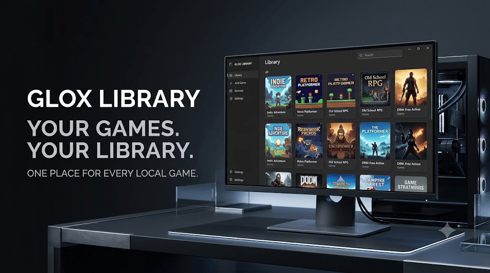

<p align="center">
  
  
  
  
  
</p>

# Glox Library

**Glox Library** is a modern local game library for Windows designed to give your games one clean, centralized interface.

Instead of relying on Steam, Epic Games, GOG Galaxy, desktop shortcuts, or other launchers, Glox Library lets you manually add your local games and launch their actual executable files directly.

Add a game once, configure it once, and keep it in your personal library.

---

## ✦ Why Glox Library?

Not every game you own belongs to Steam or Epic Games.

You may have:

* GOG games
* Older PC games
* Indie games
* DRM-free games
* Manually installed games
* Games no longer available on major storefronts
* Games stored on external drives
* Games distributed outside traditional launchers
* Standalone `.exe` games

Glox Library gives all of them one consistent home.

> **Your games. Your library. Your way.**

---

## ✦ Features

| Feature                         | Description                                                                    |
| :------------------------------ | :----------------------------------------------------------------------------- |
| 🎮 **Local Game Library**       | Build a personal collection of locally installed Windows games.                |
| ▶️ **Direct EXE Launching**     | Launch the actual game executable directly from the library.                   |
| 🖼️ **Custom Game Covers**      | Assign your own vertical cover artwork to every game.                          |
| 🏷️ **Custom Game Names**       | Give every game the exact name you want displayed.                             |
| 📝 **Game Descriptions**        | Add optional descriptions to your games.                                       |
| 🔍 **Game Search**              | Quickly filter your collection by game name.                                   |
| 🎨 **20 Themes**                | Choose from 20 built-in visual themes.                                         |
| ✨ **Animated Card Glow**        | Game cards feature animated accent-colored hover effects.                      |
| 💾 **Persistent Configuration** | Game names, covers, executables, descriptions, and IDs are stored locally.     |
| 🗂️ **JSON Storage**            | Library configuration is stored in a lightweight local JSON database.          |
| 🖥️ **Frameless UI**            | Modern custom window with rounded corners and a floating appearance.           |
| 🌑 **Modern Interface**         | Dark, polished, futuristic desktop-library aesthetic.                          |
| 📐 **Responsive Library Grid**  | Game cards automatically arrange themselves according to available space.      |
| 🗑️ **Game Management**         | Remove games from your library whenever you want.                              |
| ⚡ **Lightweight**               | Designed as a simple personal launcher without requiring a storefront backend. |

---

## ✦ How It Works

Glox Library keeps the process simple:

```text
ADD GAME
   ↓
ENTER GAME NAME
   ↓
SELECT GAME COVER
   ↓
SELECT GAME .EXE
   ↓
OPTIONAL DESCRIPTION
   ↓
SAVE
   ↓
GAME STORED IN YOUR LIBRARY
   ↓
CLICK GAME
   ↓
PLAY
```

The library stores the configuration locally so the game can be launched from Glox Library without depending on a desktop shortcut.

---

## ✦ Local Game Configuration

Each game is stored with information such as:

```json
{
    "id": "unique-game-id",
    "title": "Game Name",
    "cover": "path/to/cover.png",
    "exe": "path/to/game.exe",
    "description": "Optional game description"
}
```

The library data is stored locally inside:

```text
~/.gloxlibrary/games.json
```

This means your personal game collection is maintained independently from third-party game launchers.

---

## ✦ Themes

Glox Library currently includes **20 built-in themes**:

|   | Theme         |   | Theme        |
| - | ------------- | - | ------------ |
| ◼ | Obsidian      | ◼ | Arctic       |
| ◼ | Midnight Blue | ◼ | Ocean        |
| ◼ | Emerald       | ◼ | Forest       |
| ◼ | Neon Lime     | ◼ | Cyber Cyan   |
| ◼ | Violet        | ◼ | Royal Purple |
| ◼ | Rose          | ◼ | Crimson      |
| ◼ | Inferno       | ◼ | Sunset       |
| ◼ | Amber         | ◼ | Gold         |
| ◼ | Espresso      | ◼ | Glox Cream   |
| ◼ | Slate         | ◼ | Monochrome   |

---

## ✦ Interface

Glox Library is built around a simple philosophy:

**The games should be the focus.**

The interface uses:

* Rounded game cards
* Cover-focused presentation
* Animated accent glows
* Search
* Theme switching
* Custom window controls
* Scrollable library
* Minimal configuration
* Direct launching

No unnecessary storefront features.

No social feed.

No advertisements.

Just your games.

---

## ✦ Installation

Download the latest Glox Library package from:

**[Download Glox Library →](DOWNLOAD.md)**

After downloading:

1. Extract the ZIP archive.
2. Open the extracted Glox Library folder.
3. Launch the included application.
4. Add your games.
5. Select the game's `.exe`.
6. Select a cover.
7. Save.
8. Click the game whenever you want to play.

---

## ✦ Download

For the current downloadable build, visit:

**[DOWNLOAD.md →](DOWNLOAD.md)**

The downloadable package is provided as a ZIP archive.

---

## ✦ Project Structure

```text
GloxLibrary/
│
├── GloxLibrary.py
├── README.md
├── DOWNLOAD.md
└── banner.png
```

> The exact contents of the distributed ZIP may differ depending on the build.

---

## ✦ Technology

Glox Library is built using:

| Technology     | Purpose                          |
| :------------- | :------------------------------- |
| **Python**     | Application logic                |
| **PySide6**    | Desktop GUI                      |
| **Qt**         | Windowing and interface system   |
| **JSON**       | Local library configuration      |
| **Subprocess** | Direct game executable launching |

---

## ✦ Philosophy

Glox Library is not trying to replace Steam, Epic Games, or GOG.

It serves a different purpose.

It is a **personal local game collection** for the games that don't fit neatly into one storefront.

Whether it's an old game you've kept for years, an indie title, a standalone executable, or a game installed from somewhere outside the major launchers:

**If it's on your PC, it belongs in your library.**

---

## ✦ Credits

**Glox Library**

Created by:

**AvgLucer | Gaurav W**
**CEO & Founder — Glox Industries**

Part of the **Glox Industries** project ecosystem.

---

## ⚠️ Usage & Educational Notice

> ⚠️ **This project is provided for teaching, learning, understanding, experimentation, and personal user purposes.**
>
> Please do **not** claim this project, its source code, design, implementation, or concepts as your own.
>
> If you study, modify, demonstrate, or build upon this project, respect the original creator and Glox Industries attribution.
>
> **Glox Library © AvgLucer | Gaurav W — Glox Industries**

---

<p align="center">
  <b>GLOX LIBRARY</b><br>
  Your games. Your library. Your way.
</p>
