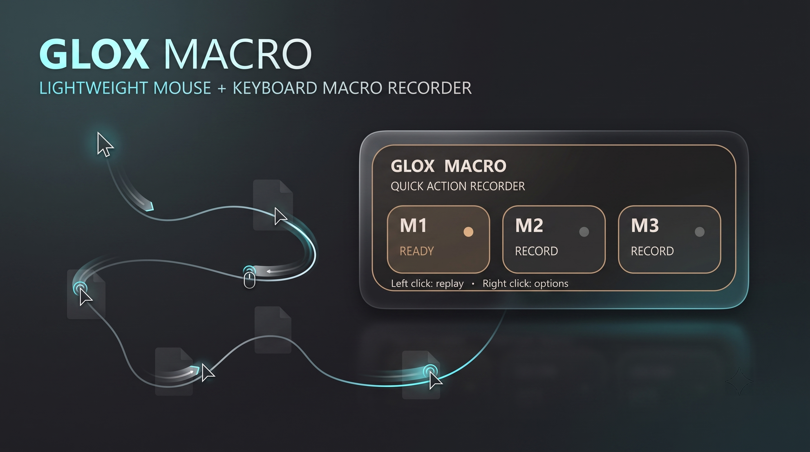

<div align="center">



# GLOX Macro

### Lightweight Mouse + Keyboard Macro Recorder

Record real mouse movements, clicks, scrolling, and keyboard input — then replay the recorded sequence with its original timing.

<p>
  
  
  
  
</p>

<p>
  <b>GLOX MACRO</b> is a lightweight three-slot macro recorder designed for quick, simple desktop automation.
</p>

</div>

---

## ✨ Overview

**GloxMacro** records actual mouse and keyboard input events as they happen.

Instead of simply storing a description of an action, it captures the sequence of events — including mouse coordinates, clicks, scrolling, keyboard presses/releases, and their relative timing — and can replay that sequence later.

The application provides **three independent macro slots**, making it easy to keep frequently used sequences ready for quick replay.

---

## 🚀 Features

| Feature                          | Description                                                                    |
| -------------------------------- | ------------------------------------------------------------------------------ |
| 🎯 **3 Macro Slots**             | Store up to three independent recorded macros in M1, M2, and M3.               |
| 🖱️ **Mouse Movement Recording** | Captures mouse movement and coordinates throughout a recording.                |
| 🖱️ **Mouse Click Recording**    | Records left, right, and middle mouse button presses and releases.             |
| 🖱️ **Scroll Recording**         | Captures vertical and horizontal scrolling events.                             |
| ⌨️ **Keyboard Recording**        | Records keyboard character input as well as supported special keys.            |
| ⏱️ **Timing Preservation**       | Stores event timing so playback follows the recorded sequence timing.          |
| ▶️ **Macro Replay**              | Reproduces recorded mouse and keyboard interactions automatically.             |
| 💾 **Persistent Storage**        | Saved macros remain available between application launches.                    |
| 🎨 **Multiple Themes**           | Includes Obsidian, Graphite, Espresso, Slate, Midnight, and Pearl Glass.       |
| 🔆 **Opacity Control**           | Adjust the widget opacity between 50%, 60%, 80%, and 100%.                     |
| 🪟 **Always-on-Top Widget**      | Compact floating interface designed for quick access.                          |
| 🖱️ **Draggable Interface**      | Move the widget anywhere on the desktop.                                       |
| ⚡ **Lightweight**                | Minimal interface focused on quick recording and replay.                       |
| 🔧 **Context Menu**              | Right-click access to recording, clearing, themes, opacity, refresh, and exit. |

---

## 🖥️ Interface

GloxMacro uses a compact floating interface with three dedicated macro slots:

```text
┌──────────────────────────────────────┐
│  GLOX MACRO                          │
│  QUICK ACTION RECORDER               │
│                                      │
│  ┌────────┐ ┌────────┐ ┌────────┐   │
│  │ M1     ●│ │ M2     ○│ │ M3     ○│   │
│  │ READY   │ │ RECORD  │ │ RECORD  │   │
│  └────────┘ └────────┘ └────────┘   │
│                                      │
│ Left click: replay • Right: options  │
└──────────────────────────────────────┘
```

The interface is intentionally small and unobtrusive so it can remain accessible while working with other applications.

---

## 🔄 How It Works

### 1. Record

Choose one of the three macro slots and begin recording.

GloxMacro listens for supported mouse and keyboard events and stores them with timing information.

### 2. Perform Your Actions

Perform the sequence you want to capture.

This can include:

* Mouse movement
* Mouse clicks
* Scrolling
* Keyboard presses
* Keyboard releases
* Pauses between actions

### 3. Save

When recording ends, the captured event sequence is stored in the selected macro slot.

The configuration is persisted locally so the macro can remain available after restarting the application.

### 4. Replay

Left-click a recorded macro slot to replay its captured sequence.

GloxMacro reconstructs the recorded mouse and keyboard events and attempts to reproduce their original timing.

---

## 📦 Installation

Clone the repository:

```bash
git clone https://github.com/AvgLucer/GloxWidgets.git
cd GloxWidgets/GloxMacro
```

Install the required dependencies:

```bash
pip install -r requirements.txt
```

Run GloxMacro:

```bash
python gloxmacro.py
```

> Make sure Python is installed and available in your system PATH.

---

## 📥 Download

Want the ready-to-use version instead of running the source code?

**Download GloxMacro from:**

[**→ DOWNLOAD.md**](DOWNLOAD.md)

The download page contains the available packaged releases and installation information.

---

## ⚙️ Configuration

GloxMacro automatically stores its configuration locally.

The configuration file is:

```text
~/.glox_macro.json
```

It contains information such as:

* Recorded macro event data
* Selected theme
* Selected opacity

The application creates the configuration file automatically when required.

---

## 🎨 Available Themes

| Theme           | Style                                 |
| --------------- | ------------------------------------- |
| **Obsidian**    | Dark glass with cyan accents          |
| **Graphite**    | Neutral graphite with cool highlights |
| **Espresso**    | Warm brown glass aesthetic            |
| **Slate**       | Cool blue-gray interface              |
| **Midnight**    | Deep blue/purple dark interface       |
| **Pearl Glass** | Light translucent glass appearance    |

---

## 🛠️ Tech Stack

| Technology    | Purpose                                  |
| ------------- | ---------------------------------------- |
| **Python**    | Core application logic                   |
| **PySide6**   | Desktop interface and rendering          |
| **pynput**    | Mouse and keyboard event capture/control |
| **JSON**      | Local macro/configuration storage        |
| **threading** | Background macro playback                |
| **QPainter**  | Custom widget rendering                  |

---

## 📁 Project Structure

```text
GloxMacro/
│
├── gloxmacro.py
├── requirements.txt
├── DOWNLOAD.md
├── banner.png
└── README.md
```

---

## ⚠️ Usage Warning

GloxMacro can generate real mouse and keyboard input on your computer.

**Use recorded macros only on applications, accounts, games, websites, and systems where you are authorized to automate actions.**

Some software, online services, games, workplaces, or websites may prohibit macros or automated input. Using automation where it is prohibited may result in account restrictions, bans, unintended actions, or other consequences.

GloxMacro does **not** guarantee that its input will be considered human-generated or that any application will fail to detect automated input.

Always test a macro carefully before using it on important work or data.

The developer is not responsible for damage, data loss, account restrictions, bans, or other consequences resulting from misuse of the software.

---

## 👤 Credits

**GloxMacro** is part of the **Glox Widgets** ecosystem.

### Founder & CEO

**AvgLucer | Gaurav W**

Designed, developed, and maintained under the **GLOX** brand.

---

## 📄 License

This project is distributed according to the license included with the repository.

Please review the repository's license before modifying, redistributing, or commercially using the software.

---

<div align="center">

**GLOX MACRO**

*Record it. Save it. Replay it.*

Built by **AvgLucer | Gaurav W**

</div>
