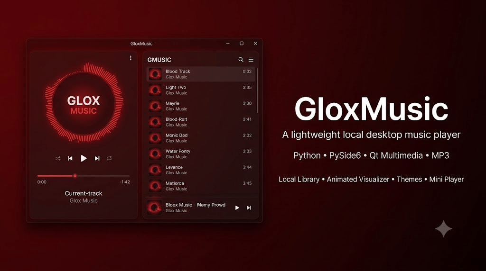

# 🎵 GloxMusic



<div align="center">


</div>

---

# 🎵 GloxMusic

**Your Music • Your Space**

GloxMusic is a lightweight, elegant desktop music player designed around local music playback, personalization, multiple themes, and a clean modern interface.

Built as part of the **Glox** software ecosystem.

---

# 📥 Download

Want to get started with GloxMusic?

### 👉 [Download GloxMusic](DOWNLOAD.md)

The dedicated **DOWNLOAD.md** contains the available download options, installation instructions, requirements, and additional information regarding releases.

> **Recommended:** Read `DOWNLOAD.md` before installing a packaged build.

---

# ✨ Features

| Feature                 | Description                                      |
| ----------------------- | ------------------------------------------------ |
| 🎵 Local Music Playback | Play locally stored music files                  |
| 📁 Local Music Library  | Access your personal music collection            |
| ▶️ Playback Controls    | Previous, Play/Pause and Next                    |
| ⏱️ Seek / Progress      | Navigate through the currently playing track     |
| 📊 Music Visualizer     | Dynamic visualizer integrated into the player    |
| 🎨 Multiple Themes      | 8 built-in visual themes                         |
| 🤍 Crystal Cream        | Light premium interface                          |
| 🌑 Midnight             | Dark cinematic interface                         |
| 🌊 Ocean                | Cool ocean-inspired interface                    |
| 💜 Lavender             | Soft lavender interface                          |
| ⚙️ Graphite             | Neutral professional interface                   |
| 🌿 Sage                 | Calm green interface                             |
| 🌹 Rose                 | Elegant rose interface                           |
| 🩸 Blood Red            | Signature GloxMusic theme                        |
| 🪟 Adjustable Opacity   | Customize application transparency               |
| 💾 Persistent Settings  | Preserve personalization settings                |
| 🧩 Mini Player          | Compact floating playback experience             |
| ⚡ Lightweight           | Designed to remain simple and resource-conscious |
| 🖥️ Desktop Application | Designed for Windows desktop usage               |

---

# 🎨 Built-in Themes

GloxMusic includes **8 built-in themes**.

|  # | Theme         | Style                  |
| -: | ------------- | ---------------------- |
| 01 | Crystal Cream | Light / Elegant        |
| 02 | Midnight      | Dark / Cinematic       |
| 03 | Ocean         | Blue / Cool            |
| 04 | Lavender      | Purple / Soft          |
| 05 | Graphite      | Neutral / Professional |
| 06 | Sage          | Green / Calm           |
| 07 | Rose          | Pink / Elegant         |
| 08 | Blood Red     | Red / Signature Glox   |

All themes represent the **same GloxMusic application and interface**, presented through different visual identities.

---

# 🎧 Playback

GloxMusic provides the essential controls required for a clean desktop music experience.

### Playback Controls

```text
Previous  →  Play / Pause  →  Next
```

### Included

* Previous track
* Play / Pause
* Next track
* Track progress
* Seek functionality
* Current track information
* Local music playback
* Music visualizer

---

# 📚 Local Music Library

GloxMusic is designed around **your own music collection**.

The player focuses on locally available music rather than requiring an online streaming platform.

### Concept

```text
Your Computer
      │
      ▼
Local Music
      │
      ▼
GloxMusic Library
      │
      ▼
Playback
```

Useful for:

* Personal music collections
* Offline playback
* Educational demonstrations
* Development/testing
* Local media libraries

---

# 🪟 Mini Player

GloxMusic includes a compact mini-player experience.

The full player can transition into a smaller floating playback interface while maintaining the application's visual identity.

### Design Goals

* Compact
* Minimal
* Easy to access
* Non-intrusive
* Consistent with the main player

---

# ⚙️ Personalization

GloxMusic provides multiple customization options.

| Setting             | Available |
| ------------------- | :-------: |
| Themes              |     ✅     |
| Adjustable Opacity  |     ✅     |
| Persistent Settings |     ✅     |
| Mini Player         |     ✅     |
| Visualizer          |     ✅     |
| Local Playback      |     ✅     |

---

# 🛠️ Technology Stack

| Technology       | Purpose                              |
| ---------------- | ------------------------------------ |
| Python           | Core application development         |
| PySide6          | Desktop graphical user interface     |
| Qt               | Application UI framework             |
| Qt Multimedia    | Audio playback functionality         |
| Python Libraries | Supporting application functionality |

---

# 📋 Project Specifications

| Specification   | Details                       |
| --------------- | ----------------------------- |
| Project         | GloxMusic                     |
| Developer       | AvgLucer | Gaurav W           |
| Organization    | Glox                          |
| Category        | Desktop Music Player          |
| Platform        | Windows                       |
| Language        | Python                        |
| GUI Framework   | PySide6                       |
| UI Framework    | Qt                            |
| Audio Framework | Qt Multimedia                 |
| Architecture    | Desktop Application           |
| Primary Use     | Local Music Playback          |
| Themes          | 8                             |
| Music Source    | Local Files                   |
| Interface       | Custom GloxMusic UI           |
| Design Language | Minimal / Premium / Cinematic |

---

# 🚀 Running From Source

Clone the repository:

```bash
git clone <YOUR-REPOSITORY-URL>
```

Enter the project directory:

```bash
cd GloxMusic
```

Install dependencies:

```bash
pip install -r requirements.txt
```

Run the application:

```bash
python gloxmusic.py
```

> Replace the filename with the actual application entry point if your version uses a different file.

---

# 🧰 Requirements

A typical development environment requires:

```text
Python 3.x
PySide6
Qt Multimedia
```

Install the primary dependency:

```bash
pip install PySide6
```

Additional dependencies may be required depending on the current build.

---

# 🛡️ Windows Defender / Antivirus Notice

## ⚠️ IMPORTANT

Depending on how GloxMusic is packaged, compiled, distributed, or executed, **Windows Defender or another antivirus program may occasionally display a warning or block the application.**

This **does not automatically mean that GloxMusic is a virus**.

Security software can sometimes flag:

* Unsigned executables
* PyInstaller-packaged applications
* Newly created executables
* Applications without an established reputation
* Applications interacting with local files
* Applications using multimedia/system APIs

### If Windows Defender displays a warning

Before allowing or running any application, **verify that the copy came from a trusted source and inspect the project/source code yourself.**

Do not disable Windows Defender blindly.

If you obtained a build from an unofficial or modified source, do not assume that a security warning is a false positive.

---

# 📊 Feature Overview

| Category        | Feature                    | Status |
| --------------- | -------------------------- | :----: |
| Playback        | Play / Pause               |    ✅   |
| Playback        | Previous                   |    ✅   |
| Playback        | Next                       |    ✅   |
| Playback        | Seek / Progress            |    ✅   |
| Playback        | Current Track              |    ✅   |
| Audio           | Local Playback             |    ✅   |
| Audio           | Music Visualizer           |    ✅   |
| Library         | Local Music Collection     |    ✅   |
| UI              | Custom GloxMusic Interface |    ✅   |
| Themes          | Crystal Cream              |    ✅   |
| Themes          | Midnight                   |    ✅   |
| Themes          | Ocean                      |    ✅   |
| Themes          | Lavender                   |    ✅   |
| Themes          | Graphite                   |    ✅   |
| Themes          | Sage                       |    ✅   |
| Themes          | Rose                       |    ✅   |
| Themes          | Blood Red                  |    ✅   |
| Personalization | Opacity                    |    ✅   |
| Personalization | Persistent Settings        |    ✅   |
| UI              | Mini Player                |    ✅   |

---

# 🎓 Educational Value

GloxMusic can also serve as a practical learning example for:

* Python desktop development
* PySide6
* Qt application architecture
* GUI design
* Multimedia applications
* Audio playback
* Event-driven programming
* UI state management
* Theme systems
* Persistent application settings
* Local file handling

It can be useful for students and developers exploring **Python GUI and multimedia application development**.

---

# 🏷️ Glox Branding

## Glox

**Glox** is the project/product identity behind GloxMusic.

The design philosophy focuses on:

> **Minimalism • Personalization • Utility • Premium Desktop Experiences**

### Brand Identity

| Element           | Identity              |
| ----------------- | --------------------- |
| Brand             | Glox                  |
| Product           | GloxMusic             |
| Creator           | AvgLucer | Gaurav W   |
| Position          | CEO & Founder at Glox |
| Design Philosophy | Minimal / Premium     |
| Visual Direction  | Modern / Cinematic    |
| Product Family    | Glox                  |

---

# 🧠 Design Philosophy

GloxMusic was designed around a simple principle:

> **Your Music. Your Space.**

The application focuses on keeping the player:

* Clean
* Personal
* Lightweight
* Customizable
* Visually polished
* Easy to understand

Rather than overwhelming the user with unnecessary functionality, GloxMusic focuses on the core desktop music experience.

---

# 📁 Project Structure

A typical project structure may look similar to:

```text
GloxMusic/
│
├── gloxmusic.py
├── requirements.txt
├── README.md
├── DOWNLOAD.md
├── banner.png
│
├── assets/
│   ├── icons/
│   ├── themes/
│   └── images/
│
└── ...
```

The exact structure may differ depending on the current development version.

---

# 👨‍💻 Credits

## Built By

**AvgLucer | Gaurav W**

### CEO & Founder at Glox

GloxMusic was built as part of the **Glox ecosystem** of software and desktop projects.

---

# ⚠️ Usage & Attribution Warning

**Please use GloxMusic responsibly.**

This project may be used for:

* Personal purposes
* Educational purposes
* Learning
* Teaching
* Experimentation
* Development study
* Demonstrations

However:

### ❌ DO NOT claim GloxMusic as your own product.

### ❌ DO NOT claim the project or its original implementation as your own work.

### ❌ DO NOT remove or intentionally obscure the original creator attribution.

If you use GloxMusic for learning, education, demonstrations, tutorials, teaching, or derivative experimentation, **please retain appropriate credit to the original creator.**

### Original Creator

**AvgLucer | Gaurav W**
**CEO & Founder at Glox**

---

# 📜 Disclaimer

GloxMusic is provided as a software project for personal, educational, learning, and teaching purposes.

You are responsible for ensuring that the music files you use with the application are legally obtained and that your usage complies with applicable laws and the rights of the respective copyright holders.

The developer and Glox are not responsible for music files or other content supplied by users.

---

# 🎵 GloxMusic

**Your Music • Your Space**

Built with:

**Python • PySide6 • Qt Multimedia**

---

<div align="center">

### GloxMusic

**A Glox Project**

**AvgLucer | Gaurav W**
**CEO & Founder at Glox**

</div>
