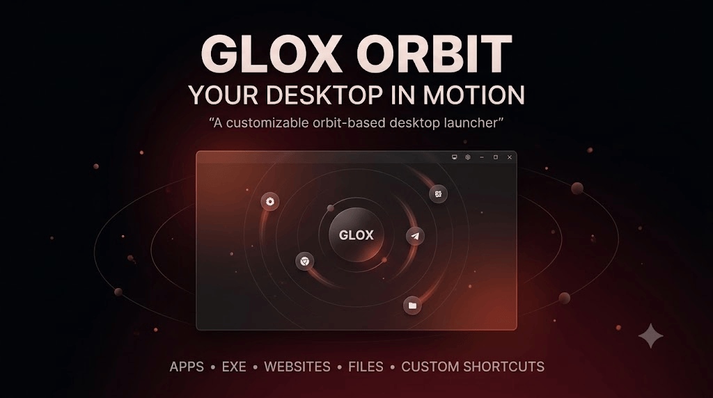

# 

<div align="center">

# 🌀 GLOX ORBIT

### **Your Desktop. In Motion.**

A cinematic, customizable desktop orbit widget that keeps your frequently used apps, executables, websites, and destinations circulating around the GLOX center.

<p>
  
  
  
  
</p>

<p>
  
  
  
  
</p>

<p>
  
  
  
  
</p>

</div>

---

## ⚠️ Important Usage & Ownership Notice

> **GLOX Orbit is a project created by Avg Lucer | Gaurav W.**

This project is provided for **user purposes, teaching, understanding, experimentation, and educational use only**.

You may use the project to:

* Learn how desktop widgets can be designed.
* Understand orbit-based UI systems.
* Study Python desktop application development.
* Experiment with glassmorphism interfaces.
* Understand animated UI elements and positioning.
* Explore customizable desktop utilities.
* Use the widget for personal/educational purposes.

### 🚫 Do Not Claim It As Your Own

**Do not claim GLOX Orbit, its concept, design, implementation, branding, or project identity as your own work.**

Do not:

* Rebrand the project and present it as an original project.
* Remove or intentionally hide the original creator attribution.
* Publish it as though you independently created it.
* Use the GLOX branding to imply ownership.
* Present the project in portfolios, repositories, videos, or publications as your own creation without appropriate attribution.

If you build something inspired by the project, clearly distinguish your own work from the original GLOX Orbit project.

### 👤 Original Creator

**Avg Lucer | Gaurav W**

**GLOX Orbit**

---

# 🌀 About GLOX Orbit

**GLOX Orbit** is a desktop widget designed around a central GLOX interface with customizable circular orbit nodes surrounding it.

Instead of keeping shortcuts scattered across the desktop, GLOX Orbit allows destinations to visually circulate around the central GLOX interface.

Destinations can represent:

* 🌐 Websites
* 📁 Files
* 🖥️ Applications
* ⚙️ Executables
* 💻 Terminal tools
* 🧑‍💻 Development environments
* 🔗 Custom destinations
* 🚀 Frequently used shortcuts

The goal is to combine **utility, motion, and visual simplicity** into a single desktop widget.

---

# ✨ Features

## 🌀 Dynamic Orbit

Create a circular orbit around the central GLOX interface.

Nodes continuously travel along the orbit while maintaining their relationship with the center.

---

## 🎯 Custom Destination Nodes

Orbit nodes can represent different destinations such as:

```text
YouTube
GitHub
Terminal
Files
VS Code
Browser
Websites
Applications
Executables
Custom shortcuts
```

---

## ⚡ Adjustable Orbit Speed

Control how quickly the orbit rotates.

The animation can be:

```text
Slow
   ↓
Normal
   ↓
Fast
```

This allows the widget to remain subtle when desired or become a more dynamic desktop interface.

---

## 🌫️ Adjustable Orbit Opacity

The orbital system can transition between:

```text
Faint / Minimal
        ↓
Semi-visible
        ↓
Clearly Visible
```

This allows the orbit to blend into the desktop instead of constantly demanding attention.

---

## 🪟 Glassmorphism Interface

GLOX Orbit follows the GLOX visual language:

* Cream / beige interface
* Translucent surfaces
* Thin typography
* Circular geometry
* Soft shadows
* Subtle glow
* Minimal visual noise
* Warm visual palette
* Clean spacing

---

# 🎨 Design Philosophy

GLOX Orbit is designed around a simple idea:

> **Your desktop doesn't have to feel static.**

The interface intentionally avoids excessive neon effects and traditional cyberpunk aesthetics.

Instead, it focuses on:

**Minimalism + Motion + Utility + Glassmorphism**

The orbit should feel like part of the desktop rather than an application aggressively sitting on top of it.

---

# 🧩 Example Orbit Layout

```text
                   ◉ GitHub

             ◉ Browser       ◉ YouTube


                    ╭──────╮
               ◉ ───│ GLOX │─── ◉
                    ╰──────╯


             ◉ Files         ◉ Terminal

                   ◉ VS Code
```

Nodes continuously follow the circular path around GLOX.

---

# 🛠️ Technology

<p>


</p>

### Core Technologies

| Technology           | Purpose                 |
| -------------------- | ----------------------- |
| Python               | Application logic       |
| PySide6              | Desktop UI              |
| Qt                   | Windowing and rendering |
| Animation            | Orbit movement          |
| Glassmorphism        | Interface styling       |
| Circular positioning | Node orbit system       |

---

# 📦 Download

The downloadable release is provided separately.

👉 **[Go to DOWNLOAD.md](DOWNLOAD.md)**

The `DOWNLOAD.md` file contains the current download link and release information.

---

# 🚀 Getting Started

1. Download GLOX Orbit using the instructions in [`DOWNLOAD.md`](DOWNLOAD.md).
2. Extract the downloaded archive.
3. Read the included project instructions.
4. Launch the widget.
5. Configure your orbit destinations.
6. Adjust speed and opacity.
7. Toggle the orbit whenever you want.

---

# 🖥️ Intended Use

GLOX Orbit is intended primarily for:

* Personal desktop customization
* Educational experimentation
* Python learning
* UI/UX experimentation
* Desktop widget development
* Understanding animated interfaces
* Studying circular positioning systems
* Creating personalized desktop workflows

---

# 📚 Educational Purpose

This project can be useful for studying concepts such as:

### Python

```text
Application structure
Event handling
Configuration
File interaction
Object-oriented programming
```

### GUI Development

```text
Windows
Widgets
Layouts
Transparency
Styling
Animations
Mouse interaction
```

### UI Animation

```text
Circular coordinates
Rotation
Position interpolation
Animation timing
Opacity transitions
State changes
```

---

# 🔐 Attribution

If you use or demonstrate GLOX Orbit, retain attribution to the original creator.

### Original Project

**GLOX Orbit**

### Creator

**Avg Lucer | Gaurav W**

---

# 📜 Project Notice

GLOX Orbit is distributed for **user purposes, teaching, understanding, experimentation, and educational purposes only**.

Using this project does **not** transfer authorship or ownership of the project to the user.

The project name, GLOX branding, original design, and original implementation remain associated with the original creator.

---

# ⭐ Support the Project

If you find the project interesting:

* ⭐ Star the repository
* 📖 Study the implementation
* 🧪 Experiment with the widget
* 💡 Build your own original ideas
* 📢 Give proper attribution when referencing the project

---

<div align="center">

### 🌀 GLOX ORBIT

**Your Desktop. In Motion.**

**Created by Avg Lucer | Gaurav W**

</div>
