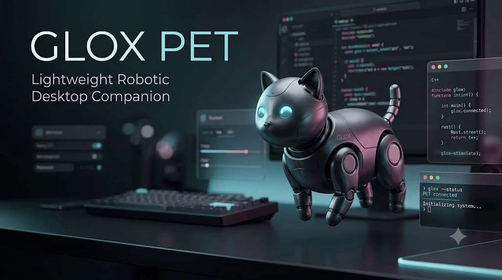

# 🐾 GLOX PET

<p align="center">
  
</p>

<h3 align="center">Lightweight Robotic Desktop Companion</h3>

<p align="center">
  A small interactive robotic pet that lives on your desktop.
</p>

---

## 🏢 GLOX INDUSTRIES

**GLOX PET** is a lightweight desktop companion built with **Python + PySide6**.

It isn't designed to be a serious productivity tool — it's designed to make your desktop feel a little more alive.

GLOX PET can walk around your screen, react to clicks, blink, sleep, change themes, display messages, perform animations, and celebrate with a full-screen fireworks effect.

---

## ✨ Features

### 🖱️ Click-Based Reactions

GLOX PET has a simple interaction system:

| Interaction  | Reaction                           |
| ------------ | ---------------------------------- |
| **1 Click**  | 💬 Happy reaction + random message |
| **2 Clicks** | 🤸 360° cartwheel                  |
| **3 Clicks** | 🎆 Fireworks celebration           |

**One click is an answer.
Two clicks is 360°.
Three clicks is fireworks.**

---

### 🐾 Autonomous Movement

GLOX PET doesn't stay completely static.

It can randomly:

* 🚶 Walk around the desktop
* 👀 Look in different directions
* 😴 Fall asleep
* 😺 Wake up
* 😉 Blink automatically
* 🧍 Remain idle

Its behavior is intentionally lightweight and randomized to give the pet a small amount of personality without unnecessary resource usage.

---

### 🎨 Multiple Themes

Customize the appearance of your pet with several built-in themes:

* **Obsidian**
* **Graphite**
* **Charcoal**
* **Espresso**
* **Slate**
* **Midnight**

Each theme changes the pet's body, accent, and eye colors.

---

### 💬 Personality

GLOX PET includes randomized messages such as:

```text
Meow!
GLOX!
Beep boop!
Who's coding?
I'm awake!
System nominal!
Meow.exe
GLOX online.
Nice click!
Boop!
```

The messages appear in a small floating speech bubble above the pet.

---

### 🎆 Fireworks

Triple-clicking the pet triggers a short celebration sequence featuring:

* 🚀 Firework rockets
* ✨ Particle explosions
* 🪔 Diwali-inspired fountains
* 🎨 Randomized colors
* 🌌 Full-screen overlay
* ⚡ Procedural animation

The entire effect is generated programmatically using Qt painting and particle physics.

No external animation assets are required.

---

### 🪶 Lightweight

GLOX PET was designed to remain simple and lightweight.

It uses:

* Python
* PySide6
* Qt timers
* QPainter
* Procedural drawing
* Lightweight particle animation

There are **no large external assets or heavy animation engines** involved.

---

## 📥 Download

<div align="center">

# 👉 Want to install GLOX PET?

### **[📦 CLICK HERE → DOWNLOAD.md](DOWNLOAD.md)**

**Installation instructions, requirements and setup are available in `DOWNLOAD.md`.**

</div>

---

## 🛠️ Built With

```text
Python
PySide6
Qt
QPainter
QTimer
Procedural Animation
Particle Physics
```

---

## 🐱 Philosophy

GLOX PET is intentionally simple.

It doesn't need to do everything.

It just needs to sit on your desktop, occasionally walk around, look at you, say something random, and remind you that your computer doesn't have to feel boring.

> **Your desktop. A little more alive.**

---

## 👨‍💻 Credits

**AvgLucer | Gaurav W**
Founder & CEO — **GLOX Industries**

Built as part of the **GLOX Widgets** ecosystem.

---

## ⚠️ Warning & Educational Use

**GLOX PET is intended for educational, teaching, learning, experimentation, and personal use only.**

This project is provided to help users **understand Python, PySide6, Qt GUI development, desktop widgets, animation systems, event handling, and procedural graphics.**

Please **do not present, submit, or claim this project as your own original project or academic work.**

If you use or modify this project, retain the appropriate credits and attribution.

**Use responsibly. Learn from it. Build your own projects.**

---

<p align="center">

**🐾 GLOX PET**

*Your desktop. A little more alive.*

###  GLOX Industries

</p>
