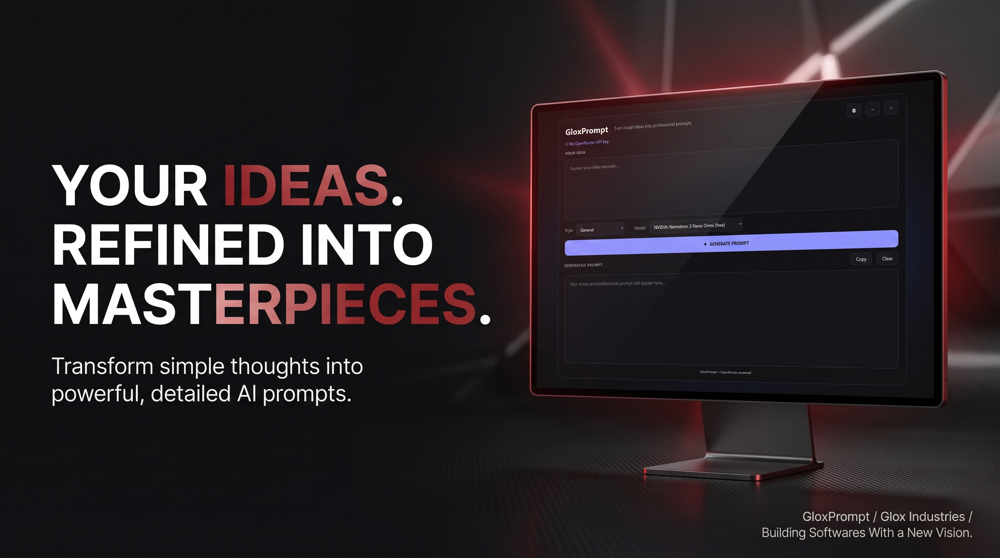
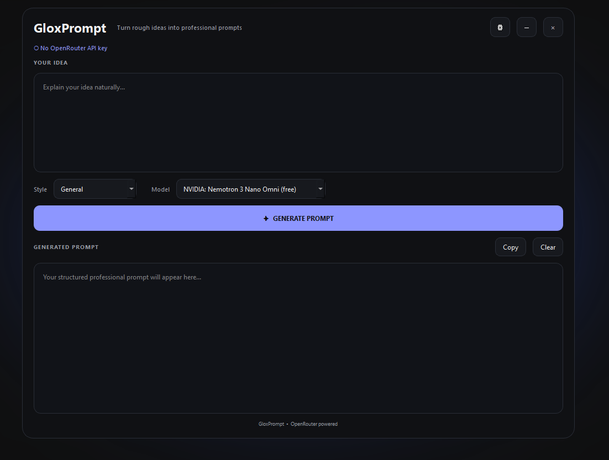

<p align="center">
  
</p>

<p align="center">
  
  
  
  
  
</p>

<p align="center">
  
  
  
  
</p>

<p align="center">
  <strong>Your Ideas. Refined Into Masterpieces.</strong>
</p>

<p align="center">
  Turn ordinary ideas into detailed, powerful and ready-to-use AI prompts.
</p>

---

# GloxPrompt

GloxPrompt is an AI-powered desktop application designed to turn simple ideas into detailed, polished and highly structured prompts.

You do not need to know advanced prompt engineering.

Describe what you want in your own words, choose an AI model, select a theme and let GloxPrompt refine your idea into a much stronger prompt.

Whether you are creating software, images, videos, websites, content, designs or experimenting with AI, GloxPrompt gives you a simple way to transform an idea into a detailed prompt.

> **You provide the idea. GloxPrompt refines it.**

---

## ✦ Why GloxPrompt?

Writing a good AI prompt can take time.

You may already know exactly what you want, but describing every detail, requirement, constraint and visual direction can be difficult.

GloxPrompt is built around a simple workflow:

```text
Your Idea
    ↓
Describe It Normally
    ↓
Choose Your AI Model
    ↓
Choose Your Theme
    ↓
Generate
    ↓
Refined Masterpiece
```

The application handles the refinement process so you can focus on the idea itself.

---

# ⚡ Features

| Feature                        | Description                                                                                               |
| :----------------------------- | :-------------------------------------------------------------------------------------------------------- |
| 🤖 **AI Prompt Generation**    | Transform simple ideas into detailed and refined AI prompts.                                              |
| 🧠 **Multiple AI Models**      | Select from the available models instead of being locked to a single model.                               |
| 🎨 **Multiple Themes**         | Personalize the application with different interface themes.                                              |
| ✍️ **Natural Language Input**  | Describe your idea normally without needing advanced prompt engineering knowledge.                        |
| ⚡ **Fast Generation**          | Typical generation takes approximately 20 to 30 seconds depending on the selected model and API response. |
| 📋 **Easy Copying**            | Copy the generated prompt and use it with your preferred AI application.                                  |
| 🔌 **OpenRouter Integration**  | Generate prompts using models available through OpenRouter.                                               |
| 🖥️ **Windows Desktop App**    | Designed as a dedicated desktop application for Windows.                                                  |
| 🔐 **Local API Configuration** | Keep your API configuration inside your local `.env` file.                                                |
| ✨ **Clean Interface**          | Focused UI designed around creating and refining ideas.                                                   |

---

# 🎯 What Can You Create?

GloxPrompt can help refine ideas for many different types of AI workflows.

| Category              | Examples                                                            |
| :-------------------- | :------------------------------------------------------------------ |
| 💻 **Software**       | Applications, websites, scripts, automation and development ideas   |
| 🎨 **Images**         | Posters, advertisements, product visuals and creative artwork       |
| 🎬 **Video**          | Promotional videos, cinematic concepts and video generation prompts |
| 🌐 **Web Design**     | Websites, landing pages, dashboards and UI concepts                 |
| ✍️ **Writing**        | Articles, stories, scripts, documentation and creative writing      |
| 🧠 **AI Workflows**   | Structured instructions, assistants and experimentation             |
| 📚 **Education**      | Learning, demonstrations, explanations and experimentation          |
| 💡 **Creative Ideas** | Turn rough concepts into detailed creative directions               |

---

# 🖥️ Interface

<p align="center">
  
</p>

The interface is designed to keep the process simple:

**Idea → Model → Theme → Generate → Copy**

No complicated workflow is required.

---

# 🎨 Themes

GloxPrompt includes multiple interface themes so the application can match your preferred environment.

Choose a theme before generating and continue working with the interface style you prefer.

The themes are designed to change the appearance of the application while keeping the core workflow straightforward.

---

# 🧠 Model Selection

GloxPrompt gives you control over which available AI model is used.

Instead of automatically forcing one model, the application provides a model selection interface.

This allows you to experiment with different models and choose one based on factors such as:

* Response quality
* Generation speed
* Model capabilities
* Availability
* Provider limits

Model availability can change over time.

Some models may become unavailable, change their limits or require different access depending on the API provider.

---

# ⚙️ How To Use

### 1. Launch GloxPrompt

Open:

```text
GloxPrompt.exe
```

### 2. Select a model

Choose one of the available AI models from the model selector.

### 3. Choose a theme

Select the interface theme you want to use.

### 4. Describe your idea

Write your idea naturally.

For example:

```text
I want a futuristic desktop application for generating
AI prompts with a clean dark interface.
```

You do not need to write a professionally engineered prompt yourself.

### 5. Generate

Start the generation process and wait approximately 20 to 30 seconds in typical conditions.

### 6. Copy

Review the generated prompt and copy it for use with another AI tool.

---

# 🔑 API Configuration

GloxPrompt uses an API connection through OpenRouter.

You need to provide your own API key.

Create a `.env` file in the application's expected directory.

Example:

```env
OPENROUTER_API_KEY=your_api_key_here
```

You can use the included `.env.example` as a starting point.

### Important

Never publish your actual API key.

Do not upload a `.env` file containing your real credentials to GitHub or any other public location.

If an API key is accidentally exposed, revoke it and replace it with a new one through your API provider.

---

# 📦 Download

Want the ready-to-use Windows executable?

Go to:

## [→ DOWNLOAD GloxPrompt](DOWNLOAD.md)

The `DOWNLOAD.md` file contains the available download information and instructions for getting started with the executable.

---

# 🛠️ Technology

| Technology           | Role                               |
| :------------------- | :--------------------------------- |
| 🐍 **Python**        | Core application language          |
| 🖼️ **PySide6**      | Desktop graphical interface        |
| 🔌 **OpenRouter**    | AI model API access                |
| 🔐 **python-dotenv** | Environment variable configuration |
| 🪟 **Windows**       | Primary executable platform        |

---

# 📁 Project Structure

```text
GloxPrompt/
│
├── GloxPrompt.exe
│
├── .env.example
│
├── README.md
│
├── README.txt
│
├── DOWNLOAD.md
│
└── banner.png
```

---

# 🔒 Security

Your API key belongs to you.

GloxPrompt requires an API key for its AI generation functionality, but the key should always remain private.

Keep:

```text
.env
```

out of public repositories.

Use:

```text
.env.example
```

when sharing the project structure without exposing credentials.

---

# 🧩 Troubleshooting

### GloxPrompt does not start

Make sure you are running the correct executable and that Windows security software has not blocked the application.

### Prompt generation fails

Check:

* Internet connection
* API key
* Selected model
* API availability
* Account access or credits where required

### A model does not work

Model availability can change. Try another available model from the selector.

### Generation takes longer than expected

Generation time depends on the selected model, network conditions and provider response time.

The typical generation time is around 20 to 30 seconds, but it can vary.

### API key is not detected

Make sure:

```text
.env
```

is named correctly and contains:

```env
OPENROUTER_API_KEY=your_api_key_here
```

Also ensure the application is reading the `.env` file from its expected location.

---

# 💡 The Philosophy

GloxPrompt was built around a simple idea:

> **You shouldn't need to know advanced prompt engineering just to explain what you want.**

Your idea can start as one sentence.

GloxPrompt helps turn that sentence into something much more detailed and structured.

The goal is not to replace creativity.

The goal is to give your creativity a better starting point.

---

# 👤 Credits

## AvgLucer | Gaurav W

**Founder & CEO at Glox Industries**

GloxPrompt was created and developed by:

**AvgLucer | Gaurav W**

**Glox Industries**

> **Building Softwares With a New Vision.**

---

# ⚠️ Educational & Usage Warning

GloxPrompt is provided for **user, teaching, understanding, learning, experimentation and educational purposes**.

Users are encouraged to explore the software, understand how it works and learn from its implementation.

This project must **not** be falsely presented or claimed as an independently created project by someone who did not originally develop it.

If you use, reference, study or build upon GloxPrompt for educational purposes, please provide appropriate credit to:

**AvgLucer | Gaurav W**
**Founder & CEO, Glox Industries**

Please respect the original creator and the work involved in developing GloxPrompt.

---

<p align="center">

<strong>Glox Industries</strong>

<br>

Building Softwares With a New Vision.

<br><br>


</p>
