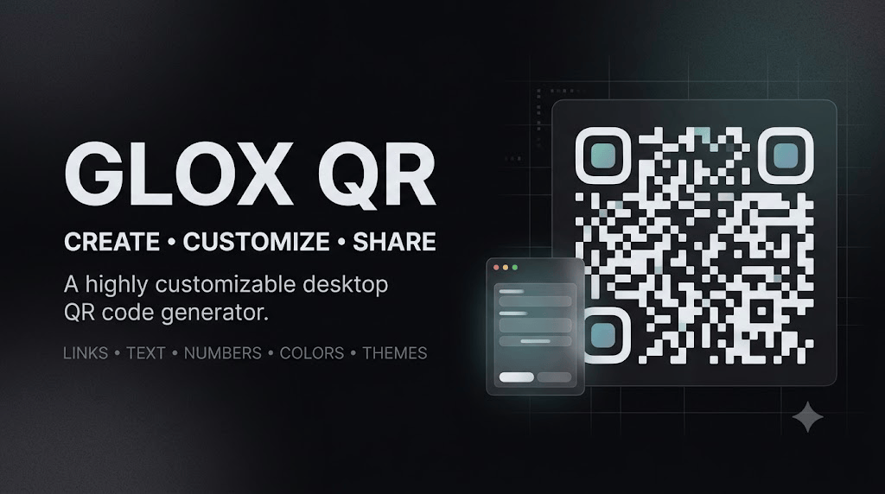

<p align="center">
  
</p>

<h1 align="center">Glox QR</h1>

<p align="center">
  <strong>A fast, lightweight & highly customizable desktop QR code generator.</strong>
</p>

<p align="center">
  Turn links, text, numbers and other content into beautiful, customizable QR codes — directly from your desktop.
</p>

<p align="center">
  
  
  
  
  
</p>

<p align="center">
  <a href="DOWNLOAD.md">⬇️ Download</a>
  •
  <a href="#features">Features</a>
  •
  <a href="#usage">Usage</a>
  •
  <a href="#project-structure">Project Structure</a>
</p>

---

## ✨ About

**Glox QR** is a lightweight desktop QR code generator built as part of the **Glox Widgets** ecosystem.

It is designed around one simple idea:

> **Enter your content → customize your QR → generate → export.**

Whether you're creating a QR code for a website, a piece of text, a number, a redirect URL, or another text-based payload, Glox QR provides a quick and visually customizable workflow without requiring an online QR generator.

### 💡 What can you generate?

* 🔗 Website URLs
* 🌐 Redirect links
* 📝 Plain text
* 🔢 Numbers
* 📋 Text-based information
* 🔤 Other QR-compatible string data

---

## 🚀 Features

### 🎨 Deep Customization

Make the generated QR match your preferred visual style.

* Multiple built-in application themes
* Custom foreground QR color
* Custom background color
* Adjustable QR dimensions
* Configurable error correction
* Different visual combinations
* Live preview / generation workflow
* Clean, high-quality PNG output

### 📱 QR Generation

Generate QR codes from virtually any text-based input.

```text
https://example.com
        ↓
      Glox QR
        ↓
   █████████████
   ██ ▄▄▄▄▄ ██
   ██ █   █ ██
   ██ █▄▄▄█ ██
   █████████████
```

The same workflow can be used for URLs, text, numbers, redirects and other compatible data.

### 💾 Export & Sharing

Once generated, your QR code can be:

* 📋 Copied for quick sharing
* 💾 Saved as a PNG
* 🖼️ Used in documents, websites and graphics
* 📤 Shared through other applications

### 🖥️ Desktop Experience

Glox QR follows the visual philosophy of the **Glox Widgets** collection:

* Modern dark UI
* Rounded interface elements
* Minimal controls
* Compact desktop footprint
* Fast interaction
* No unnecessary complexity

---

## ⚡ Why Glox QR?

Traditional online QR generators often require opening a browser, navigating a website and dealing with advertisements or unnecessary UI.

Glox QR keeps the process local and simple:

```text
┌─────────────────────────┐
│       GLOX QR            │
├─────────────────────────┤
│                         │
│  Enter your content     │
│  ┌───────────────────┐  │
│  │ https://glox...   │  │
│  └───────────────────┘  │
│                         │
│  Customize              │
│  Color • Size • Theme   │
│                         │
│       [ GENERATE ]      │
│                         │
│     ┌─────────────┐     │
│     │    QR CODE  │     │
│     └─────────────┘     │
│                         │
│    Copy   •   Save      │
└─────────────────────────┘
```

---

## 🧭 Usage

### 1. Enter Content

Paste or type the information you want to encode.

### 2. Customize

Choose your preferred:

* QR color
* Background
* Size
* Error correction
* Application theme

### 3. Generate

Press **Generate** and Glox QR creates the QR code.

### 4. Export

Copy the QR image or save it as a PNG file.

---

## 📦 Download

Want to use the ready-to-run version?

### 👉 [Download Glox QR](DOWNLOAD.md)

The **DOWNLOAD.md** file contains the available download information and installation/run instructions.

---

## 🛠️ Built With

| Technology                | Purpose                    |
| ------------------------- | -------------------------- |
| **Python**                | Core application logic     |
| **PySide6**               | Desktop GUI                |
| **QR generation library** | QR code creation           |
| **Windows**               | Primary supported platform |

Glox QR is intentionally kept lightweight and focused on doing one job well.

---

## 📁 Project Structure

```text
GloxQR/
│
├── banner.png
├── gloxqr.py
├── README.md
└── DOWNLOAD.md
```

### `gloxqr.py`

Main application containing the Glox QR interface, QR generation workflow, customization controls and export functionality.

### `README.md`

Project documentation and feature overview.

### `DOWNLOAD.md`

Download and installation information for the application.

### `banner.png`

Project banner displayed at the top of the README.

---

## 🎯 Design Philosophy

Glox QR follows the broader **Glox Widgets** philosophy:

> **Small tools. Clean interfaces. Useful features.**

The goal isn't to turn QR generation into a complicated design suite.

It is to provide a **fast, customizable and convenient desktop utility** that stays out of the way.

---

## 🔐 Privacy

Glox QR is designed as a desktop utility.

Your QR content is entered directly into the application rather than requiring a browser-based QR generator workflow.

**Always verify the content of a QR code before sharing it publicly.**

---

## 🧩 Part of Glox Widgets

**Glox QR** is one of the utilities in the growing **Glox Widgets** ecosystem.

Glox Widgets focuses on creating lightweight desktop tools that combine:

* ⚡ Speed
* 🎨 Customization
* 🖥️ Desktop-first experiences
* 🧩 Single-purpose utilities
* 🧠 Practical functionality

---

## 👨‍💻 Credits

**Glox QR**
Part of the **Glox Widgets** project.

Created by **AvgLUCER | Gaurav W.**

Built with Python and PySide6.

---

## ⚠️ Disclaimer

Glox QR is provided for **educational, personal and practical utility purposes**.

Please use generated QR codes responsibly and verify encoded content before distributing them.

If you use, modify or redistribute this project, please respect the original project's attribution and licensing terms.

---

<p align="center">
  <strong>GLOX</strong>
  <br>
  <sub>Small tools. Big ideas.</sub>
</p>
