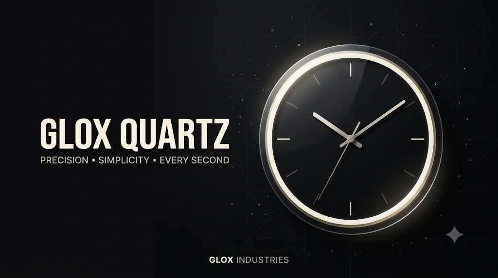

# Glox Quartz
<p align="center">
  
</p>


[](https://www.python.org/)
[](https://doc.qt.io/qtforpython/)
[](https://www.microsoft.com/windows/)
[](https://github.com/AvgLucer/GloxWidgets)
[](LICENSE)
[](DOWNLOAD.md)

> A beautiful, lightweight desktop clock from the Glox Widgets collection.

Glox Quartz is a minimal circular desktop clock designed to stay out of your way while adding a clean, customizable look to your desktop.

---

## ✨ Features

- 🕐 Smooth animated circular clock
- 🎨 Multiple built-in themes
- 🪟 Adjustable window opacity
- ◉ Rounded glass-style interface
- 🖥️ Floating desktop widget
- ⚡ Lightweight and fast
- 🔧 Customizable appearance
- 🌙 Designed for everyday desktop use

---

## 📥 Download

Want the ready-to-use version?

**You don't need Python or any dependencies.**

👉 [Download Glox Quartz](DOWNLOAD.md)

The download page contains the latest `.exe` release.

> **Download → Run → Enjoy Glox Quartz.**

---

## 🛠️ For Developers

Glox Quartz is built using:

- **Python**
- **PySide6**
- **Qt**

To run the source code manually:

```bash
cd GloxQuartz
pip install PySide6
python gloxquartz.py
```
### ⚠️ Usage & Attribution Warning

> **Glox Quartz is intended for consumer, learning, and educational purposes.**
>
> You are welcome to use and explore the project, but please **do not claim Glox Quartz or its source code as your own work** or present it as your own project at competitions, hackathons, portfolios, social media, or other public platforms.
>
> If you use, modify, or showcase Glox Quartz, please provide proper credit to **Glox Industries / AvgLucer** and link back to the original **GloxWidgets** repository.
>
> Unauthorized redistribution, rebranding, or representation of the project as an independently developed work is not permitted.


👨‍💻 Built By:
AvgLucer | Gaurav W.
Founder & CEO, Glox Industries
