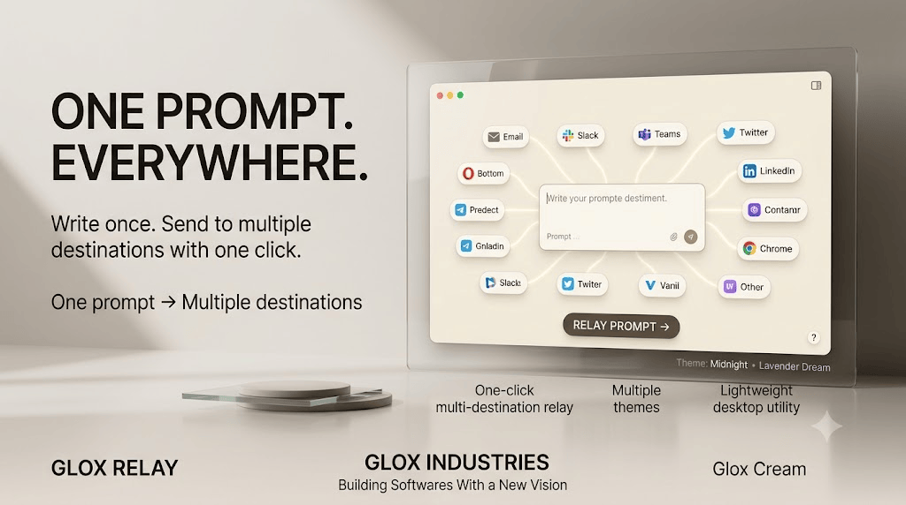

<div align="center">



<br><br>

# Glox Relay

### One Prompt • Everywhere

**Glox Relay** is a lightweight Windows desktop utility that lets you write or paste one prompt and relay it across multiple websites with a single click.

<br>


</div>

---

<div style="background:#E9D5FF;padding:10px 16px;border-radius:8px;">

## 🌸 Overview

</div>

**Glox Relay** is built for people who regularly send the same prompt, question, command, or piece of text to multiple websites.

Instead of repeatedly:

1. Copying the prompt
2. Opening a website
3. Pasting the prompt
4. Pressing Enter
5. Repeating the process

Glox Relay automates the repetitive workflow.

Write your prompt once, select your destinations, and press:

> **RELAY PROMPT →**

Glox Relay then opens the selected websites and sends the prompt to each one.

---

<div style="background:#D8B4FE;padding:10px 16px;border-radius:8px;">

## ✨ Features

</div>

| Feature                         | Description                                                                                                |
| ------------------------------- | ---------------------------------------------------------------------------------------------------------- |
| 🚀 **One-Click Relay**          | Send one prompt across multiple selected websites with a single click.                                     |
| 🌐 **Multiple Destinations**    | Relay prompts to services such as ChatGPT, Gemini, Claude, Google, Yahoo, Bing, DuckDuckGo and Perplexity. |
| 🎯 **Selectable Websites**      | Enable or disable individual destinations depending on what you want to use.                               |
| ➕ **Custom Websites**           | Add your own website destinations with a custom name and URL.                                              |
| ⚡ **Lightweight**               | Designed as a small desktop utility without unnecessary bloat.                                             |
| 🎨 **Multiple Themes**          | Includes a collection of polished Glox themes for different desktop aesthetics.                            |
| 🪟 **Always on Top**            | Keep Glox Relay accessible while working with other applications.                                          |
| 📌 **Draggable Interface**      | Move the widget around your desktop freely.                                                                |
| 🔽 **Collapse Mode**            | Minimize the interface into a compact GLOX pill when you need more screen space.                           |
| 🖱️ **Context Menu**            | Quickly access themes, opacity, websites and widget controls.                                              |
| 🔆 **Opacity Control**          | Adjust the transparency of the widget.                                                                     |
| 💾 **Persistent Configuration** | Preferences and custom destinations are stored locally.                                                    |
| ⌨️ **Keyboard Automation**      | Supports automatic pasting and optional Enter submission.                                                  |

---

<div style="background:#C084FC;padding:10px 16px;border-radius:8px;">

## 🌐 Supported Destinations

</div>

Glox Relay comes with several commonly used destinations:

| Destination    | Purpose                              |
| -------------- | ------------------------------------ |
| **ChatGPT**    | AI conversations and prompt testing  |
| **Gemini**     | AI conversations and experimentation |
| **Claude**     | AI conversations and prompt testing  |
| **Google**     | Web search                           |
| **Yahoo**      | Web search                           |
| **Bing**       | Web search                           |
| **DuckDuckGo** | Privacy-focused web search           |
| **Perplexity** | AI-powered search and research       |

You can also add your own websites through **+ Add Website**.

---

<div style="background:#A855F7;padding:10px 16px;border-radius:8px;">

## 🎨 Themes

</div>

Glox Relay includes multiple built-in themes:

| Theme              | Style                          |
| ------------------ | ------------------------------ |
| **Glox Cream**     | Soft, clean cream interface    |
| **Coffee**         | Warm coffee-inspired interface |
| **Midnight**       | Dark desktop aesthetic         |
| **Lavender Dream** | Soft lavender appearance       |
| **Deep Lavender**  | Darker lavender appearance     |
| **Golden Hour**    | Warm golden aesthetic          |
| **Sage**           | Muted green aesthetic          |
| **Rose**           | Soft rose-inspired appearance  |
| **Ocean**          | Cool blue aesthetic            |
| **Blood Red**      | Deep red aesthetic             |
| **Mono**           | Minimal monochrome appearance  |

The widget also supports adjustable opacity.

---

<div style="background:#9333EA;padding:10px 16px;border-radius:8px;">

## ⚙️ How It Works

</div>

The basic workflow is:

```text
Write / Paste Prompt
        ↓
Select Destinations
        ↓
Click "RELAY PROMPT →"
        ↓
Glox Relay Opens Websites
        ↓
Prompt Is Pasted
        ↓
Optional Enter Submission
        ↓
Next Destination
```

Glox Relay uses desktop automation to perform the repetitive copy, paste and submission workflow.

---

<div style="background:#7E22CE;padding:10px 16px;border-radius:8px;">

## 🖥️ Interface

</div>

The main interface contains:

| UI Element         | Function                                       |
| ------------------ | ---------------------------------------------- |
| **GLOX RELAY**     | Application header                             |
| **Prompt Area**    | Write or paste the prompt to relay             |
| **Destinations**   | Select websites that should receive the prompt |
| **+ Add Website**  | Add a custom destination                       |
| **RELAY PROMPT →** | Start the relay process                        |
| **Status**         | Shows the current relay state                  |
| **Settings**       | Access configuration and appearance controls   |
| **Collapse**       | Convert the widget into a compact GLOX pill    |
| **Quit**           | Close Glox Relay                               |

---

<div style="background:#6B21A8;padding:10px 16px;border-radius:8px;">

## 📁 Configuration

</div>

Glox Relay stores its configuration locally at:

```text
~/.gloxrelay/config.json
```

This configuration can contain:

* Selected destinations
* Custom websites
* Theme preference
* Opacity preference
* Destination settings

The application does not require a traditional installation directory for its configuration.

---

<div style="background:#581C87;padding:10px 16px;border-radius:8px;">

## 🛠️ Requirements

</div>

* Windows
* Python 3.x
* PySide6
* PyAutoGUI

Install the required Python packages with:

```bash
pip install PySide6 pyautogui
```

Then run:

```bash
python gloxrelay.py
```

---

<div style="background:#4C1D95;padding:10px 16px;border-radius:8px;">

## 📌 Usage

</div>

### 1. Launch Glox Relay

Start the application.

### 2. Enter Your Prompt

Write or paste your prompt into the main text area.

### 3. Select Destinations

Select the websites where you want the prompt to be sent.

### 4. Relay

Click:

```text
RELAY PROMPT →
```

Glox Relay will process the selected destinations automatically.

### 5. Add Custom Websites

Use:

```text
+ Add Website
```

to add another destination.

---

<div style="background:#3B0764;padding:10px 16px;border-radius:8px;">

## ⚠️ Important

</div>

Glox Relay relies on browser interaction and desktop automation.

Website layouts, input fields, loading times, login requirements, security systems, or other changes made by third-party websites may affect automation behavior.

Use the application responsibly and only with websites where you are permitted to perform automated interactions.

---

<div style="background:#166534;padding:10px 16px;border-radius:8px;color:white;">

## 💚 Credits

</div>

**AvgLucer | Gaurav W**
**Founder & CEO at Glox Industries**

> Building Softwares With a New Vision.

Glox Relay is part of the **Glox Industries** ecosystem of lightweight desktop software and widgets.

---

<div style="background:#DC2626;padding:10px 16px;border-radius:8px;color:white;">

## 🚨 Educational & Usage Notice

</div>

**Glox Relay is provided for user, educational, teaching, learning, experimentation, and understanding purposes.**

This project is intended to help users understand concepts involving:

* Python desktop applications
* PySide6 interfaces
* Desktop automation
* Browser interaction
* Clipboard workflows
* GUI development
* Configuration management

**Do not claim this project or its original work as your own.**

If you use, modify, study, demonstrate, or redistribute this project, retain the appropriate attribution and license information.

---

<div style="background:#E5E7EB;padding:10px 16px;border-radius:8px;">

## 📄 License

</div>

This project is licensed under the **MIT License**.

You are free to use, copy, modify, merge, publish, distribute, sublicense, and sell copies of the software, subject to the conditions of the MIT License.

See the [`LICENSE`](LICENSE) file for the complete license text.

---

<div align="center">

### GLOX INDUSTRIES

**Building Softwares With a New Vision**

<br>

**AvgLucer | Gaurav W — Founder & CEO**

</div>
