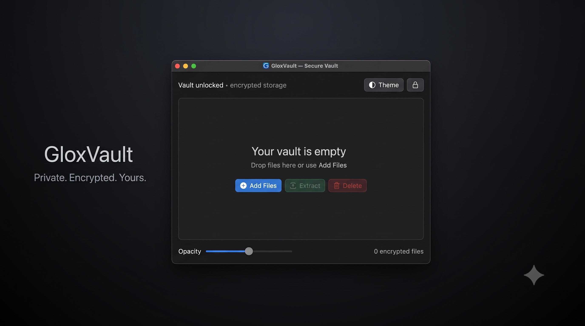

  

<h1 align="center">GloxVault</h1>

  Privacy-focused file encryption and storage with the <code>.glox</code> format.

  
  
  
  
  

---

# 🔐 GloxVault

**GloxVault** is a privacy-focused file protection widget designed to securely store encrypted files on drives such as USB flash drives, external drives, and local storage.

Files added to GloxVault are encrypted and converted into the `.glox` file format. These protected files are designed to be accessed through GloxVault rather than being directly usable as their original files.

GloxVault is designed around a simple idea:

> **Your files. Your password. Your vault.**

---

## ✨ Features

| Feature | Description |
|---|---|
| 🔐 **File Encryption** | Encrypt files before storing them inside the vault. |
| 📦 **`.glox` Format** | Protected files are stored using the `.glox` extension. |
| 🔑 **PIN Protection** | Create a vault password using a 4-digit or 6-digit PIN. |
| 💾 **USB / Drive Friendly** | Designed for pendrives, external drives, and other storage devices. |
| 🗂️ **Automatic Vault Folder** | GloxVault automatically creates and manages its storage directory. |
| 🎲 **Randomized File Names** | Protected files can receive randomized names such as `b10389aosldmba02945.glox`. |
| 📤 **File Extraction** | Decrypt and extract protected files when required. |
| 🗑️ **Direct Deletion** | Delete protected `.glox` files directly from the vault. |
| 🎨 **Multiple Themes** | Customize the appearance of the GloxVault interface with different themes. |
| 🛡️ **Privacy Focused** | Built around keeping sensitive files protected and inaccessible without the vault. |
| ⚡ **Simple Workflow** | Add → Encrypt → Store → Access when needed. |
| 🖥️ **Desktop Widget** | Designed as a lightweight desktop utility. |

---

# 🧠 How GloxVault Works

## 1. Create Your Vault

The first time GloxVault is opened, create a PIN.

Supported PIN formats include:

- 4-digit PIN
- 6-digit PIN

Example:

`0000`

`000000`

---

## 2. Add Files

Select the files you want to protect.

GloxVault processes the selected files and encrypts them before storing them inside the vault.

---

## 3. Files Become `.glox`

The encrypted data is stored using the `.glox` extension.

Example:

    Original File
    │
    ├── presentation.pdf
    ├── personal.jpg
    └── project.zip
            │
            ▼
         GloxVault
            │
            ▼
      Encrypted Storage
            │
            ├── b10389aosldmba02945.glox
            ├── x82kq91mzla02918.glox
            └── p91xmd73kaq10482.glox

Randomized filenames help avoid exposing the original filenames through the storage directory.

---

## 4. Access Through GloxVault

Protected `.glox` files are intended to be accessed through GloxVault.

Without the appropriate vault access, the encrypted data cannot simply be opened as the original file.

---

## 5. Extract or Delete

When required, files can be:

- Extracted back into their usable form
- Removed directly from the vault

---

# 📁 Storage Structure

GloxVault automatically manages its storage directory.

A typical vault may look similar to:

    GloxVault/
    │
    └── Vault/
        │
        ├── b10389aosldmba02945.glox
        ├── a72kd91msla82031.glox
        ├── q918xmd73kaq01928.glox
        └── z291ka83msld72019.glox

The randomized filenames are intentionally unrelated to the original filenames.

---

# 🎨 Themes

GloxVault supports multiple interface themes.

Themes allow the appearance of the application to be customized while maintaining the same core vault functionality.

The goal is to provide a privacy utility that feels modern, minimal, and comfortable to use.

---

# 💾 Designed For Portable Storage

GloxVault can be particularly useful with removable storage.

For example:

    USB Drive
    │
    └── GloxVault
        │
        └── Vault
            │
            ├── encrypted_file_1.glox
            ├── encrypted_file_2.glox
            └── encrypted_file_3.glox

This makes it possible to keep protected files on a pendrive or other storage device while maintaining a dedicated vault workflow.

---

# 📥 Download

For installation and download instructions, see:

**[DOWNLOAD.md](DOWNLOAD.md)**

---

# 🚀 Basic Workflow

    Launch GloxVault
           ↓
    Create / Enter PIN
           ↓
       Open Vault
           ↓
        Add Files
           ↓
      Encrypt Files
           ↓
      Store as .glox
           ↓
    Access / Extract / Delete

---

# 🔒 Privacy Concept

GloxVault is designed around the principle that sensitive files should not remain in their ordinary, immediately usable form inside the vault.

Instead:

    Readable File
         ↓
      Encryption
         ↓
    .glox Protected File
         ↓
      GloxVault
         ↓
       Extract
         ↓
    Readable File

The `.glox` files are intended to remain encrypted until they are processed through GloxVault.

---

# ⚠️ Important Warning

> [!WARNING]
> **GloxVault is provided for user, educational, teaching, learning, experimentation, and understanding purposes only.**
>
> Do not claim GloxVault or its source code as your own project.
>
> Do not redistribute the project while falsely representing yourself as its original creator.
>
> Always respect the original project, its authors, and its license.

---

# 📜 License

GloxVault is released under the **MIT License**.

See the `LICENSE` file for the complete license text.

---

# 👨‍💻 Credits

## Glox Industries

**Founder & CEO:**  
**AvgLucer | Gaurav W**

GloxVault is part of the Glox Industries ecosystem.

> **Building Softwares With a New Vision.**

---

  <b>GloxVault</b>
   
  Privacy-focused storage. Protected by design.

  Glox Industries

