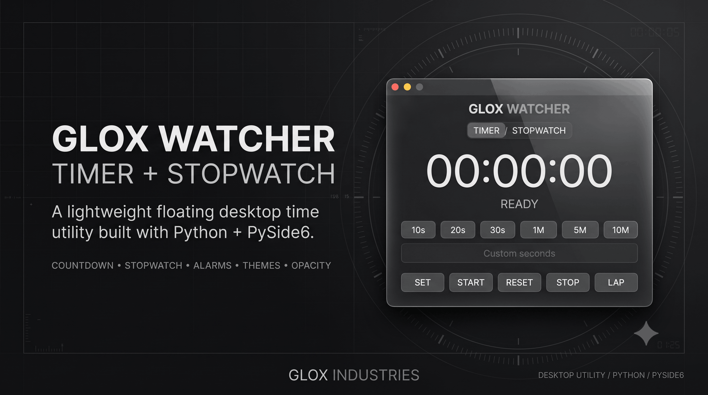

<div align="center">



# GloxWatcher

### Premium Floating Timer + Stopwatch for Windows

[](https://www.mediafire.com/file/nt06pjyowjus68o/GloxWatcher.zip/file)
[](https://www.python.org/)
[](https://doc.qt.io/qtforpython/)
[](https://www.microsoft.com/windows)
[](#)
[](#usage--warning)

<br>

**A compact, premium floating desktop utility for countdowns, stopwatches, alarms and focused time management.**

</div>

---

## Overview

**GloxWatcher** is a lightweight desktop **Timer + Stopwatch** widget built with **Python and PySide6**.

Instead of taking over the screen like a traditional clock or productivity application, GloxWatcher is designed as a compact floating utility that can remain visible while you work, study, code, create or perform timed tasks.

The application combines a simple countdown timer, precision stopwatch, customizable alarms, multiple visual themes and adjustable transparency inside a frameless always-on-top interface.

---

## ✨ Features

| Feature                       | Details                                                |
| ----------------------------- | ------------------------------------------------------ |
| ⏱️ **Countdown Timer**        | Set and run customizable countdown timers              |
| ⚡ **Quick Presets**           | 30s, 1m, 5m, 10m, 30m, 1h and 2h                       |
| ✏️ **Custom Duration**        | Enter a custom number of seconds                       |
| ⏯️ **Start / Pause / Resume** | Control an active timer or stopwatch                   |
| 🔄 **Reset**                  | Instantly reset the current session                    |
| ⏱️ **Precision Stopwatch**    | Tracks elapsed time with centisecond precision         |
| 🏁 **Lap Support**            | Record stopwatch lap times                             |
| 🔔 **Timer Alarm**            | Automatically triggers when the countdown reaches zero |
| 🔊 **Multiple Sounds**        | Nightrain, Sunrise, Groovy, Intense and Drama          |
| 🎨 **9 Themes**               | Multiple dark and light visual themes                  |
| 🪟 **Adjustable Opacity**     | 100%, 80%, 60% and 50%                                 |
| 📌 **Always On Top**          | Keeps the widget visible above other windows           |
| 🖱️ **Drag Anywhere**         | Freely reposition the floating widget                  |
| 🧊 **Glass UI**               | Premium translucent floating interface                 |
| 🖥️ **Frameless Window**      | Clean desktop-first presentation                       |
| ⚙️ **Context Menu**           | Access themes, sounds, opacity and exit controls       |

---

## 🎨 Themes

GloxWatcher includes **9 built-in visual themes**:

| Theme              | Style                 |
| ------------------ | --------------------- |
| **Obsidian**       | Deep black            |
| **Graphite**       | Dark graphite         |
| **Charcoal**       | Neutral charcoal      |
| **Espresso**       | Warm dark brown       |
| **Slate**          | Cool slate            |
| **Midnight**       | Deep blue-black       |
| **Crystal Cream**  | Light cream           |
| **Glowy Sunshine** | Warm dark yellow      |
| **Aurora Night**   | Deep atmospheric blue |

---

## 🔊 Alarm Sounds

GloxWatcher currently includes five selectable alarm sounds:

* **Nightrain**
* **Sunrise**
* **Groovy**
* **Intense**
* **Drama**

When a timer reaches zero, the selected alarm sound is triggered.

---

## ⏱️ Timer Presets

Quickly start common countdown durations:

```text
30 seconds
1 minute
5 minutes
10 minutes
30 minutes
1 hour
2 hours
```

For anything outside the presets, use the **Custom Timer** field.

---

## 🏁 Stopwatch

Switch to **STOPWATCH** mode for precision elapsed-time tracking.

The stopwatch provides:

* Start
* Pause
* Resume
* Reset
* Centisecond precision
* Lap recording

The interface automatically adapts to the selected mode.

---

## 🖥️ Desktop Experience

GloxWatcher is intentionally designed as a **floating desktop widget**.

It features:

* Frameless window
* Always-on-top behavior
* Transparent window support
* Adjustable opacity
* Drag-to-position interaction
* Compact footprint
* Minimal controls
* Right-click configuration menu

This makes it suitable for keeping a timer visible while using other applications.

---

## 🛠️ Built With

| Technology        | Purpose                         |
| ----------------- | ------------------------------- |
| **Python**        | Core application logic          |
| **PySide6**       | Desktop UI and Qt framework     |
| **Qt Multimedia** | Alarm sound playback            |
| **QTimer**        | High-frequency UI updates       |
| **QPainter**      | Custom rounded widget rendering |

---

## 📦 Download

Ready to try GloxWatcher?

The latest downloadable release is available through the dedicated download page:

### → [Download GloxWatcher](DOWNLOAD.md)

For installation instructions, usage information, available releases, and download details, please visit **[DOWNLOAD.md](DOWNLOAD.md)**.


### Timer Mode

1. Select **TIMER**.
2. Choose a preset or enter a custom duration.
3. Press **START**.
4. Use **PAUSE** / **RESUME** when needed.
5. When the timer reaches zero, the selected alarm plays.
6. Press **RESET** to clear the timer.

### Stopwatch Mode

1. Select **STOPWATCH**.
2. Press **START**.
3. Use **PAUSE** / **RESUME** as required.
4. Use **LAP** while running to record a lap.
5. Press **RESET** to clear the stopwatch.

---

## ⚙️ Customization

Right-click the widget to access:

```text
Theme
├── Obsidian
├── Graphite
├── Charcoal
├── Espresso
├── Slate
├── Midnight
├── Crystal Cream
├── Glowy Sunshine
└── Aurora Night

Alarm Sound
├── Nightrain
├── Sunrise
├── Groovy
├── Intense
└── Drama

Opacity
├── 100%
├── 80%
├── 60%
└── 50%

Exit
```

---

## ⚠️ Usage & Warning

GloxWatcher is released as a **personal productivity / educational desktop software project**.

Please use the application responsibly.

* Download releases only from the provided project distribution source.
* Use the software at your own discretion.
* Do not redistribute modified builds as official GloxWatcher releases.
* Do not remove Glox Industries / developer attribution and claim the project as your own.
* Included audio assets may have their own applicable rights or licensing conditions.
* Compatibility may vary depending on the Windows environment and packaged release.
* The software is provided **"as is"** without warranties of uninterrupted operation or compatibility.
* As with any downloaded executable, users should perform their own security checks before execution when appropriate.

### Important

**GloxWatcher is not intended to replace mission-critical timing, safety systems, industrial timing equipment, medical equipment or other systems where an inaccurate timer could cause harm or loss.**

For important or safety-critical tasks, use an appropriate dedicated system.

---

## 👨‍💻 Credits

<div align="center">

### Gaurav Wadhwani

**Founder & Developer — Glox Industries**

GloxWatcher is an original Glox Industries desktop utility developed as part of an ongoing collection of lightweight software projects.

**Concept → Development → UI → Implementation**

by **AvgLucer | Gaurav W  **

</div>

---

## 🏢 Glox Industries

GloxWatcher is part of the **Glox Industries** software ecosystem — a collection of experimental and production-oriented utilities focused on creating practical desktop tools with polished interfaces.

The philosophy:

> **Useful software doesn't have to look boring.**

---

## 📌 Project Status

**Current Status:** Active

GloxWatcher is an evolving project. Future releases may introduce additional customization, functionality and improvements.

---

## 📜 Disclaimer

GloxWatcher is an independent software project created under the Glox Industries brand.

Third-party libraries and resources remain subject to their respective licenses and terms.

The GloxWatcher name, branding, original application design and original project assets remain the property of their respective creator.

---

<div align="center">

### GLOX WATCHER

**TIME. CONTROLLED.**

Built with Python + PySide6.

<br>

**GLOX INDUSTRIES**

</div>
