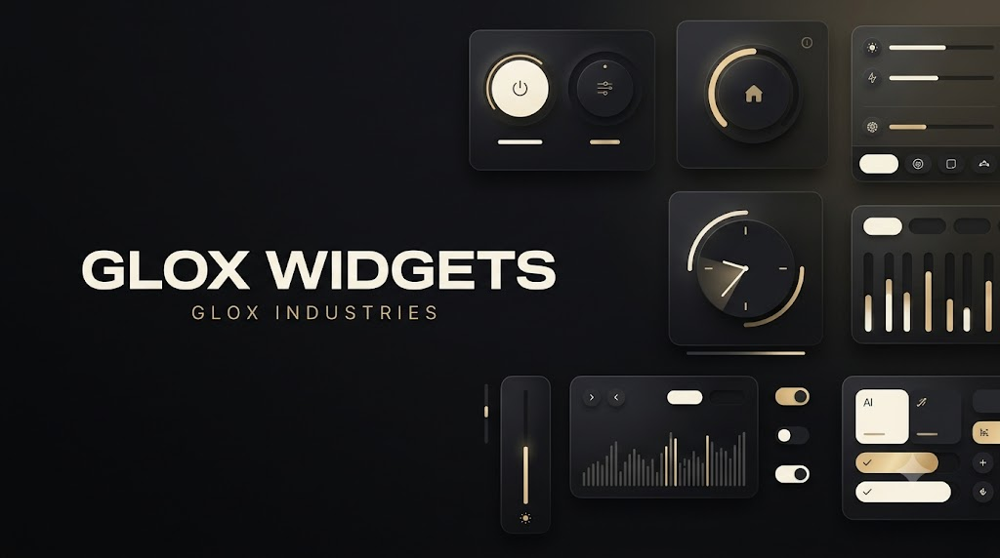

# Glox Widgets

  

> **A growing collection of lightweight, useful, and beautiful desktop widgets.**

Glox Widgets is a collection of standalone desktop utilities developed under **Glox Industries**.

Each widget is designed around one simple idea:

> **One widget. One purpose. Zero clutter.**

---

## ✨ What Are Glox Widgets?

Glox Widgets are small desktop applications designed to provide useful functionality without unnecessary complexity.

From clocks and system utilities to productivity tools and desktop companions, every widget is built to be lightweight, customizable, and easy to use.

---

## 🧩 Current Widgets

The collection is continuously growing.

Some of the widgets currently included:

- 🕐 **Glox Quartz** — Circular desktop clock

And more are being developed.

👨‍💻 Built By:
AvgLucer | Gaurav W.
Founder & CEO, Glox Industries

---

